```{r}
#| label: load-packages
#| message: false
library(tidyverse)
library(gt)

#Use this to set up the file path for all figures saved in ccissr. Unfortunately, Quarto dashboards can't display images from absolute filepaths outside the project folder (I was hoping to be able to pull figures directly from the ccissr project folder). This means that every time figures are updated in the Figures subfolder in ccissr, the easiest thing to do is copy that whole "Figures" folder and paste/replace it here. Then set up the file path here to make it slightly easier to call figures where needed below: 
fig_path <- "./Figures" #Since this qmd file is in the Cw_Western_Redcedar folder, the Figures folder also has to be inside Cw_Western_Redcedar. This means that in ccissr, it will make the most sense to create a species-specific figure folder, to then copy/paste into the specific species dashboard folders here.

# Wrapper function for loading figures
fig <- function(filename) {
  knitr::include_graphics(file.path(fig_path, filename))
} #use fig("filename.png") inside an r chunk to insert the figure where it belongs below
```

# Landing page

## Welcome information

### Col - Tree image {width="20%"}

{fig-alt="Silhouette of mature western redcedar tree"}

### Col - Welcome text {width="80%"}

Welcome to the Species Summary Dashboard for Western Redcedar (abbreviated as "Cw"), a place for species-specific summaries of the inputs and outputs of the Climate Change Informed Species Selection (CCISS) tool. This dashboard is intended to support forest practitioners, planners, and land managers, in making informed, forward-looking decisions about where Cw may be suitable to plant over the coming decades. As climate conditions shift, these decisions will become increasingly critical for maintaining productive, resilient, and adaptive forest landscapes.

At the top of the page, you will find tabs for the following summaries:

-   **Reference (historical baseline) Period**
    -   Maps and descriptive summary of the species range in British Columbia during the baseline climate normal period of 1961-1990 in terms of its environmental suitability across Biogeoclimatic (BGC) zones and across three edatopic (soil nutrient x moisture) regimes, relative to the local biogeoclimatic subzone:
        -   Poor/subxeric (B2)
        -   Mesic/zonal (C4)
        -   Rich/hygric (D6)
-   **CCISS Projections**
    -   A collection of visualizations and interpretations of the CCISS tool projections through 2100 for this species in British Columbia, exploring the changes in its suitable range over time. This includes:

        -   Projected persistence and expansion of its suitable range relative to its historically suitable range
        -   Shifts in its suitability within each BGC zone
        -   Predictions according to the different Shared Socioeconomic Pathways (SSPs) and increasing mean annual temperature (MAT)
        -   A summary of projected changes in particular areas of interest in BC
        -   Projected changes along elevational gradients
-   **Forest Health**
    -   A summary of forest health considerations and concerns for this species, interpreted in light of CCISS projections
-   **Additional Resources**
    -   A collection of other tools, websites, and guides that provide additional information about this species, particularly covering background ecology and silvics information not summarized here

**Notes for Interpreting and Applying this Summary**

This dashboard is intended to provide a species-specific overview and interpretation of the data from the CCISS tool and does not represent management recommendations. Please see the CCISS Documentation tab \> Decision Guidance section for more information on the appropriate and intended uses of these data.

For Western Redcedar, a species with high ecological, cultural, and economic value, the CCISS projections reveal a complex pattern: potential expansion of suitability into upslope and northern areas, and localized declines in low-elevation and drought-prone regions. While the tool offers valuable insights into broad-scale trends, suitability projections must be interpreted with caution. Many areas of projected change are also areas with high uncertainty in climate predictions. Furthermore, factors such as soil texture, drainage, land-use history, forest health pressures, and biotic interactions (e.g., competition or browsing) can strongly influence actual outcomes on the ground. These nuances emphasize the importance of pairing climate tools with on-the-ground knowledge and site-specific judgement when planning future Western Redcedar management.

## Row - logos

{fig-align="center" width="400"}

# Reference period

## Summary text

**Reference period**

Western Redcedar (Cw) is native to the Pacific Northwest of North America, with a broad geographic range extending from northern California, through Oregon, Washington, and British Columbia, into southeastern Alaska. Eastward, it extends as far inland as the western slopes of the Rocky Mountains in Montana and Idaho.

Western Redcedar is best adapted to climates with abundant precipitation and high humidity but can tolerate a range of conditions. In BC, Cw is most commonly found in cool and cold mesothermal climates on the coast and in montane continental cool temperate climates in the interior wet belt (Klinka and Brisco 2009). The species grows across a wide variety of soil types, but is most productive on fresh to moist, nutrient-rich soils (Klinka and Brisco 2009).

In British Columbia, Western Redcedar is found in two distinct populations: a coastal population, and an interior (Cordilleran) population. Approximately 81% of the province’s mature Cw volume is found in the coastal population (Klinka and Brisco 2009). These two populations are ecologically distinct due to differences in climatic regimes, topography, and associated vegetation, but genetically, they are quite similar (Klinka and Brisco 2009). It is common for Western Redcedar to co-occur on mesic and wet sites with Western Hemlock (*Tsuga heterophylla*) throughout its range in BC.

In the maps below, each color represents the species environmental suitability during the historical reference period\* of 1961-90 as determined by expert ratings. Green represents a high suitability (E1 rating), blue represents moderate suitability (E2), yellow represents low suitability (E3), and white indicates areas that are unsuitable for the species (EX). See CCISS Documentation tab \> Methods\>Environmental Suitability Ratings for more detailed definitions and information on the expert rating process.

\*Note on terminology: The historical reference period is sometimes referred to as the "baseline" or simply "historical" or "reference" period.

## Reference range maps

### Reference B2

```{r}
#| title: Environmental Suitability in poor/subxeric (B2) edatopes under baseline climate (1961-1990)
#| fig-asp: 1
#| out-width: 100%
#| out-height: 100%
#| padding: 0px
#| fig-cap: In poor/subxeric edatopes, the environmental suitability for Cw tends to be moderate to low, and only high in BGC subzones that are relatively wet overall (e.g., the CWHvh2 site series along the central coast).

fig("Historic_Suit_Map.Cw.B2.png") 

```

### Reference C4

```{r}
#| title: Environmental Suitability in mesic/zonal (C4) edatopes under baseline climate (1961-1990)
#| fig-asp: 1
#| out-width: 100%
#| out-height: 100%
#| padding: 0px
#| fig-cap: Environmental suitability for Cw is high in most of the mesic edatopes within its range. Suitability drops to E2 or E3 in the drier BGC subzones of its range (e.g., the CDFmm and CWHdm site series along the Strait of Georgia and surrounding low-elevation areas of its drainage basin).

fig("Historic_Suit_Map.Cw.C4.png")
```

### Reference D6

```{r}
#| title: Environmental Suitability in rich/hygric (D6) edatopes under baseline climate (1961-1990) 
#| fig-asp: 1
#| out-width: 100%
#| out-height: 100%
#| padding: 0px
#| fig-cap: The environmental suitability of Cw is high in the rich/hygric edatopes of drier subzones (e.g., CWHdm in the lower mainland) but then decreases to E2 or E3 in very wet subzone variants (as in CWHvh2 along the central coast). However, in other very wet subzone variants, its suitability remains high (e.g., CWHvh3 and CWHwh1 on Haida Gwaii). In more xeric subzones of its range (e.g., IDFxh1 and PPxh1 in the Okanagan valley), rich/hygric edatopes only provide pockets of low environmental suitability.

fig("Historic_Suit_Map.Cw.D6.png")
```

## Row below - Historical BGC pie chart {height="400px"}

**Range by Biogeoclimatic Ecosystem Classification (BEC)**

How is the total environmentally suitable area of the province (all colored areas on the maps) split across Biogeoclimatic (BGC) zones? The pie chart to the right explores this by showing the total suitable area (Km^2^) of BC for Western Redcedar by BGC zone based on climates of the historical reference period (1961-1990).

*Summary of its prevalence within these BGC zones*

On the coast, Redcedar is most abundant in the Coastal Western Hemlock (CWH) zone, especially on mesic to wet sites, where it grows alongside Douglas-fir, Grandfir, and Bigleaf Maple (Nicholson and Egan 1995). It also occurs, though less frequently, in the Coastal Douglas-fir (CDF) zone and low in the Mountain Hemlock (MH) zones, where it tends to be subdominant or scattered.

In the Interior, it is a key species in the Interior Cedar-Hemlock (ICH) zone, particularly in the wetter subzones of southeastern and central British Columbia, and in the IDF, although typically as a minor component. It can also occasionally be found in the wetter subzones of the Sub-Boreal Spruce (SBS), Montane Spruce (MS), Ponderosa Pine (PP), and lower Engelmann Spruce - Subalpine Fir (ESSF) zones (Government of British Columbia 2025).

::: card
```{r}
##| title:  Historical range by BGC zone
##| fig-show: hold
##| layout-ncol: 2

fig("Cw_histpie.png")
#fig("Cw_histbar.png")
```
:::

# CCISS projections

## Overall summary

**CCISS projections for Western Redcedar**

On this page, you will find a visual and interpretive synthesis of the CCISS tool projections for this species, including:

1.  Mean changes in environmental suitability across its geographic range in BC, by future time period and edatope.

2.  Shifts in suitability across specific provincial biogeoclimatic (BGC) zones.

3.  Shifts in the proportion of historically suitable area occupied by the species, based on three distinct shared socioeconomic pathways (SSPs) over time and mean annual temperature.

4.  Proportion of the historic range that the species will remain environmentally suitable (i.e. persist) or become newly suitable (i.e. expand) by edatope.

5.  Changes in **XYZ** across particular regions of interest in British Columbia and elevational patterns.

Overall, the total suitable area in BC for Western Redcedar is projected to increase with climate change, but the specific locations where it is most suitable will shift.

The most notable pattern observed in the interior of BC is the expansion of Cw suitability into the sub-boreal, as ICH (Interior Cedar - Hemlock)-like climates are projected to spread northward and westward into the (current) Sub-Boreal Spruce (SBS) zone. Under historical climate (1961-1990), the area between Smithers and Prince George, including the whole Interior Plateau, was unsuitable for Cw. CCISS projections suggest that much of this area will not only become suitable for Cw, but may even become moderately (E2) to highly (E1) suitable by 2100.

In addition, locations in the southeast of the province that are currently Engelmann Spruce - Subalpine Fir (ESSF) or Montane Spruce (MS) zones, are predicted to become more climatically like ICH zones in the near future, making them newly suitable for Western Redcedar. As these are two zones that are upslope of Cw's current range, this means that higher elevation areas will become more environmentally suitable for Cw over time.

Meanwhile, many parts of the Coastal Western Hemlock (CWH) and ICH zones where suitability was high during the reference period are projected to decrease in suitability and in some cases become fully unsuitable as these areas become more climatically similar to drier and/or warmer southern zones in Washington, Oregon, and California. However, in many of its most suitable habitats along the coast (e.g., with an E1 suitability ranking historically) there is little projected change in suitability. This is likely because climates are not projected to change dramatically in these subzones, but rather will be maintained by coastal upwelling and weather patterns.

These patterns are shown in 20-year intervals and by Edatopic space in the fugures below.

## 1st Row - Change maps

### 1/4 Column - Changes in suitability: map {.tabset .flow}

#### Mesic/zonal (C4)

```{r}
##| title: 2021-2040 change in environmental suitability
#| fill: false
##| fig-cap: Already in 2021-2040, a large portion of BC's northern interior plateau is projected to have newly suitable mesic areas for Cw (yellow regions on the map). Meanwhile, mesic areas of low elevation zones among the Coast and Columbia mountains are projected to decrease in suitability (pink to black colors on the map), driven by changes in their mean daily minimum temperature and precipitation as these areas become more climatically similar to southern BGC zones. Relatively few areas will increase in suitability (blue shades on the map). The boxplot shows overall mean changes in suitability ranking across the province, by BGC zone.
#| padding: 0px

#fig("Future_Map_Box.Cw.C4.2021_2040.png")
fig("Two_panel.Cw.C4.2021_2040.png")
```

#### Poor/subxeric (B2)

```{r}
##| title: 2021-2040 change in environmental suitability
#| fill: false
##| fig-cap: Text summarizing the map
#| padding: 0px

fig("Two_panel.Cw.B2.2021_2040.png")
```

#### Rich/hygric (D6)

```{r}
##| title: 2021-2040 change in environmental suitability
#| fill: false
##| fig-cap: Text summarizing the map
#| padding: 0px

fig("Two_panel.Cw.D6.2021_2040.png")
```

### 2/4 Column - Changes in suitability: map {.tabset .flow}

#### Mesic/zonal (C4)

```{r}
##| title: 2041-2060 change in environmental suitability
#| fill: false
##| fig-cap: In 2041-2060, Redcedar's newly suitable mesic range (yellow) is projected to continue expanding across the SBS in the interior plateau, becoming more dense, especially in the West toward and around Smithers. Meanwhile, it's range throughout the lowland areas of the Coast and Columbia mountains is projected to continue contracting (pink to black), with larger areas becoming increasingly unsuitable. Meanwhile, its mean suitability is projected to increase more in the Coastal Douglas Fir (CDF) and Mountain hemlock (MH) zones (boxplot and blue areas of map).
#| padding: 0px

fig("Two_panel.Cw.C4.2041_2060.png")
```

#### Poor/subxeric (B2)

```{r}
##| title: 2041-2060 change in environmental suitability
#| fill: false
##| fig-cap: Text summarizing the map
#| padding: 0px

fig("Two_panel.Cw.B2.2041_2060.png")
```

#### Rich/hygric (D6)

```{r}
##| title: 2041-2060 change in environmental suitability
#| fill: false
##| fig-cap: Text summarizing the map
#| padding: 0px

fig("Two_panel.Cw.D6.2041_2060.png")
```

## 2nd Row - Change maps

### 3/4 Column - Changes in suitability: map {.tabset .flow}

#### Mesic/zonal (C4)

```{r}
##| title: 2061-2080 change in environmental suitability
#| fill: false
##| fig-cap: The 2061-2080 time period is projected to see continuated expansion of newly suitable habitat (yellow on the map) across the northern Interior Plateau, as well as along low-elevation edges of the Coast mountains (Eastern edge) and Columbia mountains (Western edge). Previously suitable habitat in the CWH and ICH zones of these mountain ranges continue to decrease in suitability. The boxplot shows overall mean changes in suitability ranking across the province, by BGC zone.
#| padding: 0px

fig("Two_panel.Cw.C4.2061_2080.png")
```

#### Poor/subxeric (B2)

```{r}
##| title: 2061-2080 change in environmental suitability
#| fill: false
##| fig-cap: Text summarizing the map
#| padding: 0px

fig("Two_panel.Cw.B2.2061_2080.png")
```

#### Rich/hygric (D6)

```{r}
##| title: 2061-2080 change in environmental suitability
#| fill: false
##| fig-cap: Text summarizing the map
#| padding: 0px

fig("Two_panel.Cw.D6.2061_2080.png")
```

### 4/4 Column - Changes in suitability: map {.tabset .flow padding="0px"}

#### Mesic/zonal (C4)

```{r}
##| title: 2081-2100 change in environmental suitability
#| fill: false
##| fig-cap: By the 2081-2100 period, much of the Sub-boreal Spruce (SBS) zone is projected to be newly suitable for Redcedar, while much of its previous range in southern BC is projected to be less suitable or fully unsuitable. This is particularly true in low-elevation CWH and Coastal Douglas-Fir (CDF) subzones on the south end of Vancouver Island, around Squamish and the Vancouver lower mainland, and in the major valleys of the Columbia mountains (particularly in the ICH and Interior Douglas Fir (IDF) zones). In both mountain ranges, suitibility is projected to increase up-slope (into the ESSF in the interior, and the MH zones of the Coastal mountains) but decrease/disappear at its previously favorable low elevations. 
#| padding: 0px

fig("Two_panel.Cw.C4.2081_2100.png")
```

#### Poor/subxeric (B2)

```{r}
##| title: 2081-2100 change in environmental suitability
#| fill: false
##| fig-cap: Text summarizing the map
#| padding: 0px

fig("Two_panel.Cw.B2.2081_2100.png")
```

#### Rich/hygric (D6)

```{r}
##| title: 2081-2100 change in environmental suitability
#| fill: false
##| fig-cap: Text summarizing the map
#| padding: 0px

fig("Two_panel.Cw.D6.2081_2100.png")
```

## Row - Shifts in BGC suitability

**Shifts in environmentally suitable area over time by Biogeoclimatic (BGC) zone**

## Row - Suitability area: alluvial plots {height="800px"}

### Col - description

The figures to the right show the projected changes in Western Redcedar's suitable area in BC (Km^2^) over time by biogeoclimatic zone (colors)  within the three representative edatopes (mesic/zonal C4, poor/subxeric B2, and rich/hygric D6; tabs). The height of each bar represents the total environmentally suitable area for Cw in each time period, distributed across the different BGC zones. The first time period shown on the left of each graph is the historical reference period (1961-1990), where environmental suitability is determined by expert ratings (see Reference tab). The remaining time periods are based on CCISS model projections incorporating environmental suitability (from the reference period) and future climate data. It is important to remember that for the future projected time periods, the relative areas of BGC zones remain static within the province (e.g., they are not shrinking or growing). Rather, this reflects changes in the projected spatial distribution of climate types that may be more or less suitable for the focal species, representing changes in suitable area across these static zones (e.g., SBS climate becoming more 'ICH-like' which makes it suitable for Cw).

In general, Western Redcedar's total suitable area is projected to expand across BC over the century, with increased suitability in the ESSF, MH, and SBS zones, and relatively stable suitability overall in the CWH and ICH. Some expansion of suitability into the Boreal White and Black Spruce (BWBS), IDF, MS, and Sub-Boreal Pine - Spruce (SBPS) zones is also projected as these zones are projected to become warmer and wetter over time.

According to CCISS projections, many mapped units within the Sub-Boreal Spruce (SBS) zone, especially wetter subzone/variants, are projected to shift towards more Interior Cedar-Hemlock (ICH)-like climates in the future. This likely explains Cw's projected expansion of suitable area into the SBS zone, as well as small portions of the BWBS and SBPS zones. Similarly, wet variants in the lower elevation portions of the ESSF zone are projected to undergo similar shifts toward more ICH-like climates, which means that Cw's expanded suitability projected in this higher-elevation zone may lead to up-slope range expansion. The Mountain Hemlock (MS) zone is above the CWH in elevation throughout the Coast mountains and historically supported small populations of Cw at low elevations. Warming temperatures are the likely driver of expanded suitability for Cw projected in this zone as well.

### Col - Alluvial figure {.tabset}

#### Mesic/zonal (C4)

::: card
```{r}
#| title: Change in total suitable area over time, across BGC zones
 

fig("Cw_C4_alluv.png")

```

**Key to BGC zones:**

BAFA: Boreal Altai Fescue Alpine, BG: Bunchgrass, BWBS: Boreal White and Black Spruce, CDF: Coastal Douglas-fir, CMA: Coastal Mountain-heather Alpine, CWH: Coastal Western Hemlock, ESSF: Engelmann Spruce - Subalpine Fir, ICH: Interior Cedar - Hemlock, IDF: Interior Douglas-fir, IMA: Interior Mountain-heather Alpine, MH: Mountain Hemlock, MS: Montane Spruce, PP: Ponderosa Pine, SBPS: Sub-Boreal Pine - Spruce, SBS: Sub-Boreal Spruce, SWB: Spruce - Willow - Birch
:::

#### Poor/subxeric (B2)

::: card
```{r}
#| title: Change in total suitable area over time, across BGC zones

fig("Cw_B2_alluv.png")

```


**Key to BGC zones:**

BAFA: Boreal Altai Fescue Alpine, BG: Bunchgrass, BWBS: Boreal White and Black Spruce, CDF: Coastal Douglas-fir, CMA: Coastal Mountain-heather Alpine, CWH: Coastal Western Hemlock, ESSF: Engelmann Spruce - Subalpine Fir, ICH: Interior Cedar - Hemlock, IDF: Interior Douglas-fir, IMA: Interior Mountain-heather Alpine, MH: Mountain Hemlock, MS: Montane Spruce, PP: Ponderosa Pine, SBPS: Sub-Boreal Pine - Spruce, SBS: Sub-Boreal Spruce, SWB: Spruce - Willow - Birch
:::

#### Rich/hygric (D6)

::: card
```{r}
#| title: Change in total suitable area over time, across BGC zones

fig("Cw_D6_alluv.png")

```


**Key to BGC zones:**

BAFA: Boreal Altai Fescue Alpine, BG: Bunchgrass, BWBS: Boreal White and Black Spruce, CDF: Coastal Douglas-fir, CMA: Coastal Mountain-heather Alpine, CWH: Coastal Western Hemlock, ESSF: Engelmann Spruce - Subalpine Fir, ICH: Interior Cedar - Hemlock, IDF: Interior Douglas-fir, IMA: Interior Mountain-heather Alpine, MH: Mountain Hemlock, MS: Montane Spruce, PP: Ponderosa Pine, SBPS: Sub-Boreal Pine - Spruce, SBS: Sub-Boreal Spruce, SWB: Spruce - Willow - Birch
:::

## Row - spacer

**Broad trends in projected suitability changes**

## Row - Suitability area spaghetti plots

::: column
### Col - Spaghetti Figure {.tabset}

#### Time period

```{r}
#| title: Change in the total suitable area over time, faceted by edatope

fig("Cw_spag.png")

```

#### MAT

```{r}
#| title: Change in the total suitable area as mean annual temperature (C) increases, faceted by edatope

fig("Cw_spag2.png")

```
:::

::: column
### Col - Description

The figure to the left shows the projected trends for the change in proportion of the species' historically suitable area within the three representative edatopes (poor/subxeric B2, mesic/zonal C4, and rich/hygric D6), from the years 2000 to 2080. Note there are two tabs: the first plotted by time period, and the second plotted by mean annual temperature (MAT) in Celcius. Each thin line represents a different biogeoclimatic projection model and the thick lines represent the overall mean.

On the first tab, each colored line represents one of the Shared Socioeconomic Pathways (SSPs):

-   The optimistic scenario of SSP1-2.6 (yellow) aligns with strong mitigation efforts to limit warming to 2°C
-   The scenario of SSP2-4.5 (orange) reflects current policies with moderate mitigation
-   The high-emission scenario SSP3-7.0 (red) assumes no mitigation, leading to steadily increasing emissions

For Western Redcedar, this figure shows that the amount of suitable area relative to its historic range is going to increase in all projected scenarios, with only a small increase in the optimistic scenario, a larger increase with moderate greenhouse gas mitigation, and the largest range expansion in the high-emission scenario. This trend is projected to be similar across the three edatopes.

The second figure shows that the projected proportion of historically suitable area occupied by Redcedar will increase with increasing mean annual temperature.
:::

## Row - Bubble plot {height="600px"}

### L Column - Plot description

The figure on the right shows the overall projected persistence and expansion of the suitability of Western Redcedar relative to its historically suitable range, in each of the three main Shared Socioeconomic Pathways (SSPs; tabs). Each colorful point represents the mean of the 15-member GCM ensemble for an edatope (B2: Poor/subxeric sites, C4: mesic/zonal sites, D6: rich/hygric sites) averaged across all BGC zones in the province, with the surrounding shaded ellipses ("bubbles") representing the 1-standard deviation probability of the ensemble calculated for each point. The grey dashed line divides areas of the plot for which total feasible area is either growing (above the line) or shrinking (below the line). Note that all results exclude biogeoclimatic units that do not currently support commercially operable forest, and that expansion (the y-axis) is log-scaled.

Because an edatope is relative to each BGC (e.g., a mesic site in the Coastal Western Hemlock (CWH) zone is relatively wetter than a mesic site in the Interior Douglas Fir (IDF)), it's important to note that the size of the bubbles shown here are likely influenced by the underlying differences in magnitude of suitability across biogeoclimatic zones. Thus, this plot is meant to be a broad overview perspective by edatope across the entire province.

This figure shows that Western Redcedar is overall projected to persist within about 40-60% of its historically suitable range, while its suitable range is projected to expand slightly, to be about 1-1.5 times larger than the historically suitable range. Expansion of Cw's suitable area is projected to be driven by higher temperatures expected under the increased warming scenarios of SSP245 and SSP370. These trends are similar across the three edatopes, which are shown to be clustered tightly together for this species. This suggests that within a BGC zone, populations of Redcedar in different edatopes will respond similarly to climate change.

### R Column - Bubble plot {.tabset}

#### SSP126

```{r}
#| title: Bubble figure showing the ensemble mean for each edatope in the SSP126 scenario
#| fill: FALSE

fig("Cw_ssp126_bub.png") 
```

#### SSP245

```{r}
#| title: Bubble figure showing the ensemble mean for each edatope in the SSP245 scenario
#| fill: FALSE

fig("Cw_ssp245_bub.png") 
```

#### SSP370

```{r}
#| title: Bubble figure showing the ensemble mean for each edatope in the SSP370 scenario
#| fill: FALSE

fig("Cw_ssp370_bub.png") 
```

## Areas of interest

**Regions of interest:**

Text and maps and/or plots zooming in to any particular geographic areas of interest

## Elevational patterns {.flow}

**Elevational patterns:** Text to summarize elevational patterns

### Elevation plots

```{r}
#| title: Elevational patterns plots, for each edatope? Or each BGC?
#| layout-ncol: 3

ggplot(iris, aes(x = Sepal.Length, y = Petal.Length, color = Species)) +
  geom_point() +
  labs(title = "Elevation plot 1") +
  theme_classic()

ggplot(iris, aes(x = Sepal.Length, y = Petal.Length, color = Species)) +
  geom_point() +
  labs(title = "Elevation plot 2") +
  theme_classic()

ggplot(iris, aes(x = Sepal.Length, y = Petal.Length, color = Species)) +
  geom_point() +
  labs(title = "Elevation plot 3") +
  theme_classic()

```

# Test page

#### Mesic/zonal (C4)

```{=html}
### Changes in suitability: map {.tabset .flow}

#### Mesic/zonal (C4)

<div id="c4-carousel" class="carousel slide" data-bs-ride="false" data-bs-interval="false">

  <div class="carousel-indicators">
    <button type="button" data-bs-target="#c4-carousel" data-bs-slide-to="0"
            class="active" aria-current="true" aria-label="2021–2040"></button>
    <button type="button" data-bs-target="#c4-carousel" data-bs-slide-to="1"
            aria-label="2041–2060"></button>
    <button type="button" data-bs-target="#c4-carousel" data-bs-slide-to="2"
            aria-label="2061–2080"></button>
    <button type="button" data-bs-target="#c4-carousel" data-bs-slide-to="3"
            aria-label="2081–2100"></button>
  </div>

  <div class="carousel-inner">

    <div class="carousel-item active">
      <figure class="m-0">
        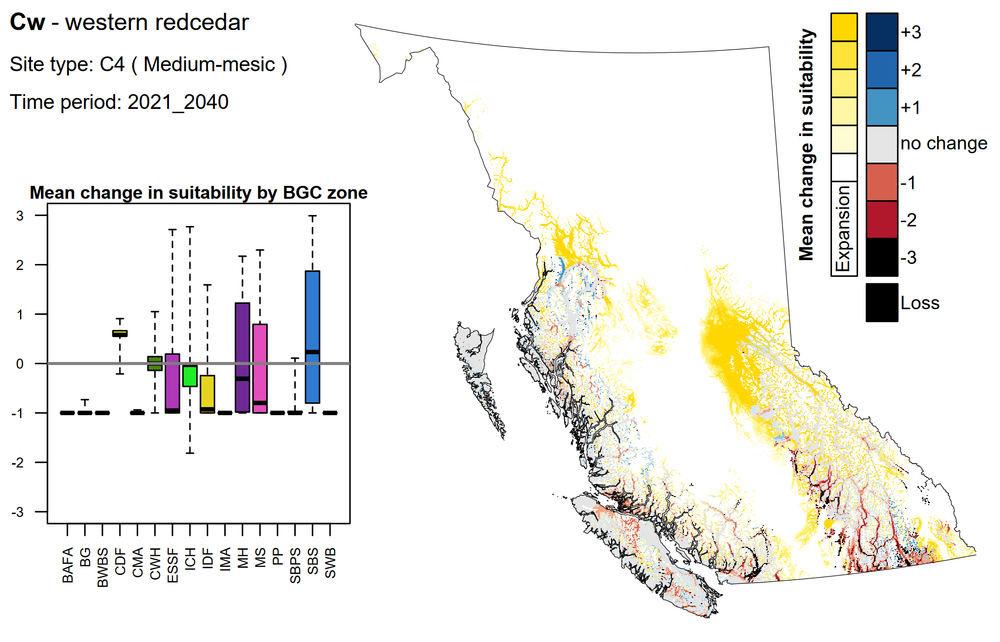
        <figcaption class="small text-muted mt-2">
          Already in 2021–2040, a large portion of BC's northern interior plateau is projected to have newly suitable mesic areas for Cw. Meanwhile, mesic areas of low elevation zones among the Coast and Columbia mountains are projected to decrease in suitability, driven by changes in their mean daily minimum temperature and precipitation as these areas become more climatically similar to southern BGC zones. (add description of boxplot for more detail on BGC zones)
        </figcaption>
      </figure>
    </div>

    <div class="carousel-item">
      <figure class="m-0">
        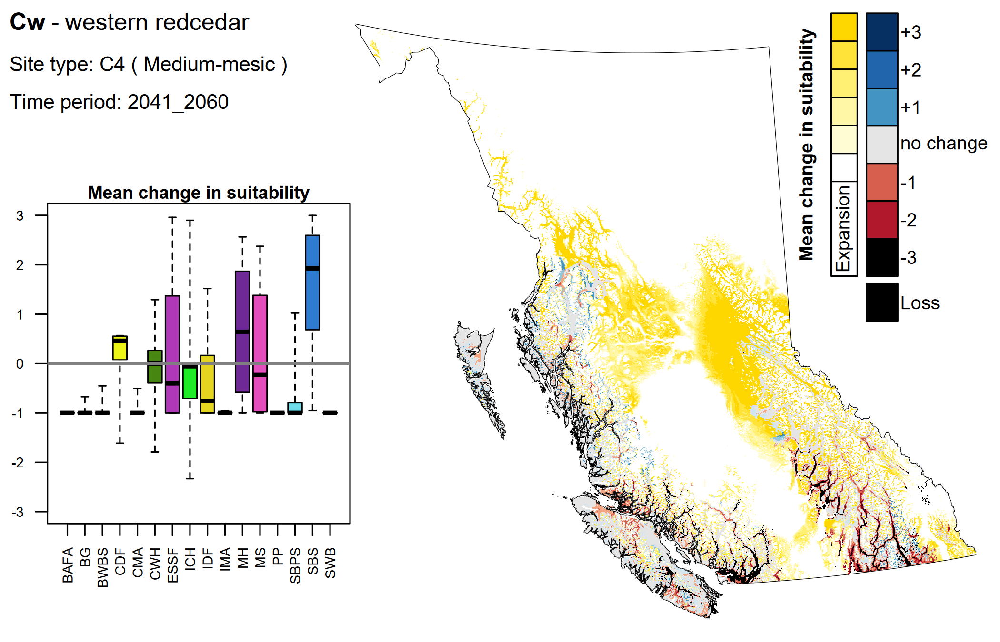
        <figcaption class="small text-muted mt-2">
          Caption for 2041–2060 (C4)…
        </figcaption>
      </figure>
    </div>

    <div class="carousel-item">
      <figure class="m-0">
        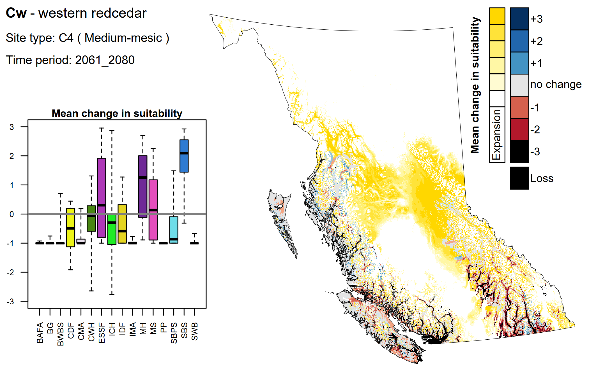
        <figcaption class="small text-muted mt-2">
          Caption for 2061–2080 (C4)…
        </figcaption>
      </figure>
    </div>

    <div class="carousel-item">
      <figure class="m-0">
        
        <figcaption class="small text-muted mt-2">
          Caption for 2081–2100 (C4)…
        </figcaption>
      </figure>
    </div>

  </div>

  <button class="carousel-control-prev" type="button"
          data-bs-target="#c4-carousel" data-bs-slide="prev">
    <span class="carousel-control-prev-icon" aria-hidden="true"></span>
    <span class="visually-hidden">Previous</span>
  </button>

  <button class="carousel-control-next" type="button"
          data-bs-target="#c4-carousel" data-bs-slide="next">
    <span class="carousel-control-next-icon" aria-hidden="true"></span>
    <span class="visually-hidden">Next</span>
  </button>

</div>
```

#### Poor/subxeric (B2)

```{=html}
<div id="b2-carousel" class="carousel slide" data-bs-ride="false" data-bs-interval="false">

  <div class="carousel-indicators">
    <button type="button" data-bs-target="#b2-carousel" data-bs-slide-to="0"
            class="active" aria-current="true" aria-label="2021–2040"></button>
    <button type="button" data-bs-target="#b2-carousel" data-bs-slide-to="1"
            aria-label="2041–2060"></button>
    <button type="button" data-bs-target="#b2-carousel" data-bs-slide-to="2"
            aria-label="2061–2080"></button>
    <button type="button" data-bs-target="#b2-carousel" data-bs-slide-to="3"
            aria-label="2081–2100"></button>
  </div>

  <div class="carousel-inner">

    <div class="carousel-item active">
      <figure class="m-0">
        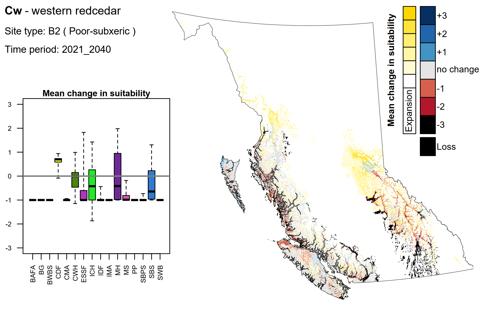
        <figcaption class="small text-muted mt-2">
          Text summarizing the map
        </figcaption>
      </figure>
    </div>

    <div class="carousel-item">
      <figure class="m-0">
        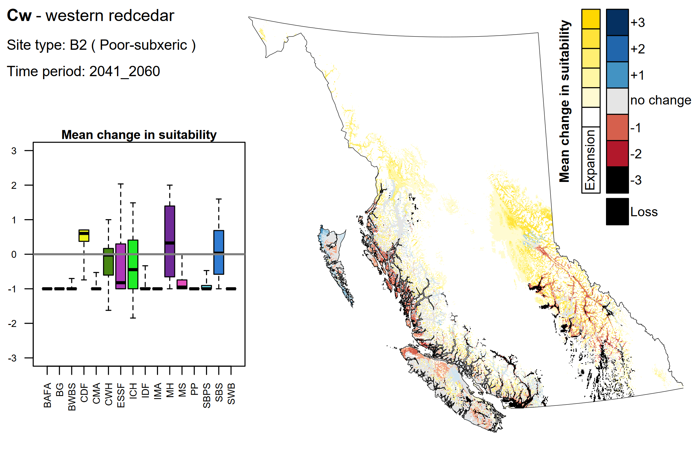
        <figcaption class="small text-muted mt-2">
          Caption for 2041–2060 (B2)…
        </figcaption>
      </figure>
    </div>

    <div class="carousel-item">
      <figure class="m-0">
        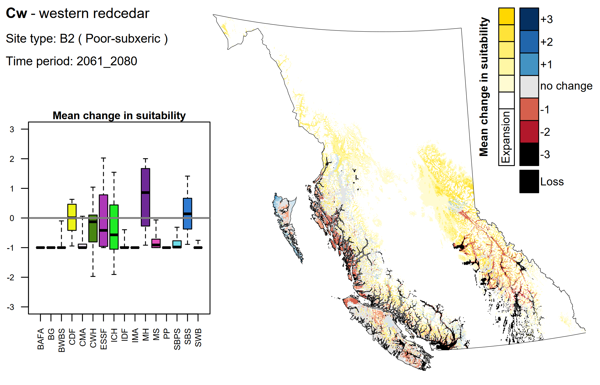
        <figcaption class="small text-muted mt-2">
          Caption for 2061–2080 (B2)…
        </figcaption>
      </figure>
    </div>

    <div class="carousel-item">
      <figure class="m-0">
        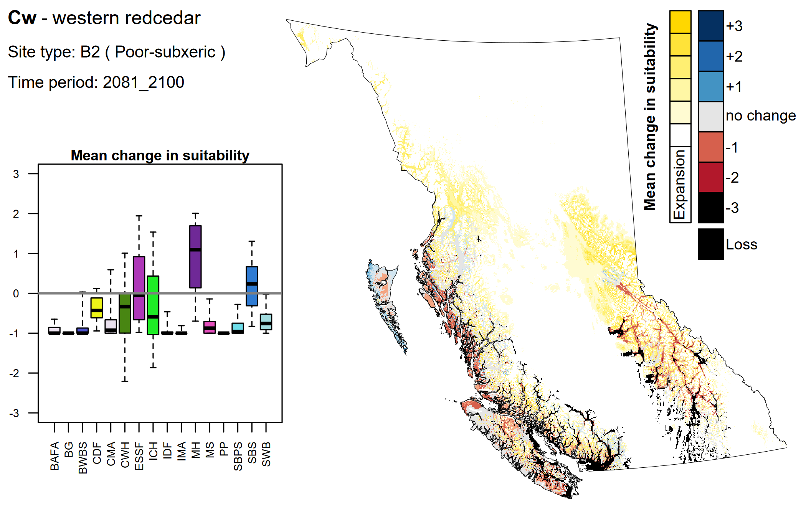
        <figcaption class="small text-muted mt-2">
          Caption for 2081–2100 (B2)…
        </figcaption>
      </figure>
    </div>

  </div>

  <button class="carousel-control-prev" type="button"
          data-bs-target="#b2-carousel" data-bs-slide="prev">
    <span class="carousel-control-prev-icon" aria-hidden="true"></span>
    <span class="visually-hidden">Previous</span>
  </button>

  <button class="carousel-control-next" type="button"
          data-bs-target="#b2-carousel" data-bs-slide="next">
    <span class="carousel-control-next-icon" aria-hidden="true"></span>
    <span class="visually-hidden">Next</span>
  </button>

</div>
```

#### Rich/hygric (D6)

```{=html}
<div id="d6-carousel" class="carousel slide" data-bs-ride="false" data-bs-interval="false">

  <div class="carousel-indicators">
    <button type="button" data-bs-target="#d6-carousel" data-bs-slide-to="0"
            class="active" aria-current="true" aria-label="2021–2040"></button>
    <button type="button" data-bs-target="#d6-carousel" data-bs-slide-to="1"
            aria-label="2041–2060"></button>
    <button type="button" data-bs-target="#d6-carousel" data-bs-slide-to="2"
            aria-label="2061–2080"></button>
    <button type="button" data-bs-target="#d6-carousel" data-bs-slide-to="3"
            aria-label="2081–2100"></button>
  </div>

  <div class="carousel-inner">

    <div class="carousel-item active">
      <figure class="m-0">
        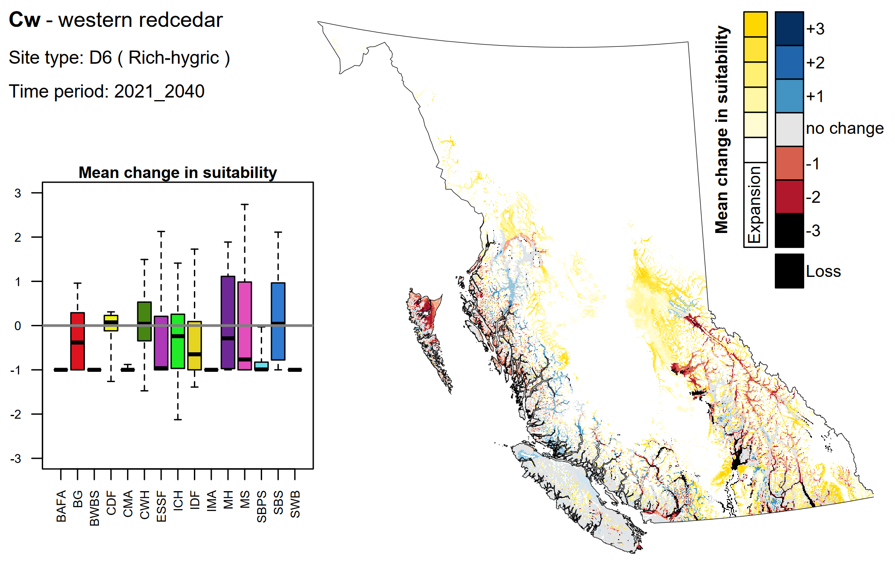
        <figcaption class="small text-muted mt-2">
          Text summarizing the map
        </figcaption>
      </figure>
    </div>

    <div class="carousel-item">
      <figure class="m-0">
        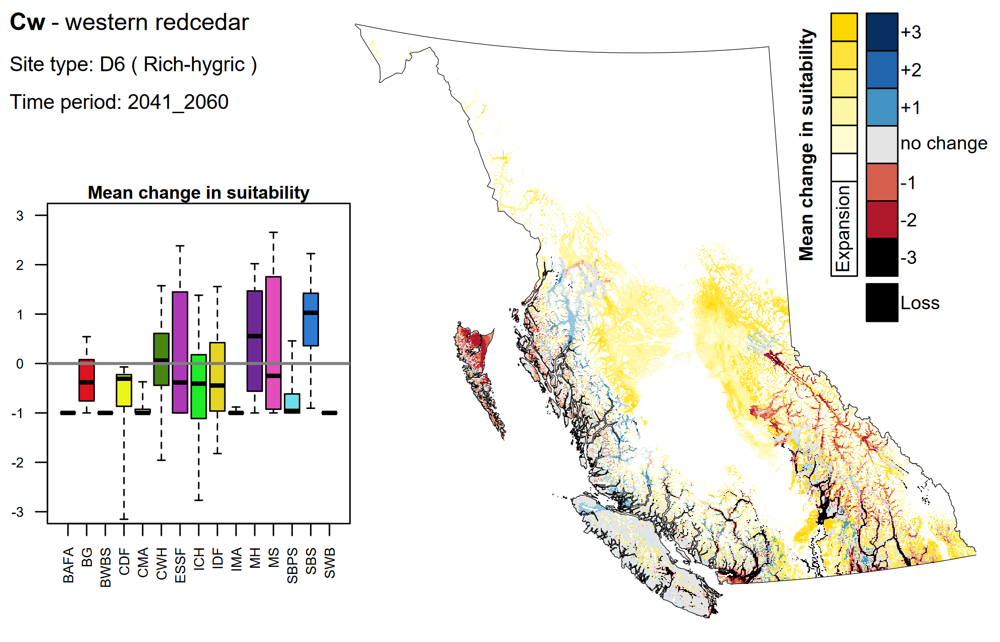
        <figcaption class="small text-muted mt-2">
          Caption for 2041–2060 (D6)…
        </figcaption>
      </figure>
    </div>

    <div class="carousel-item">
      <figure class="m-0">
        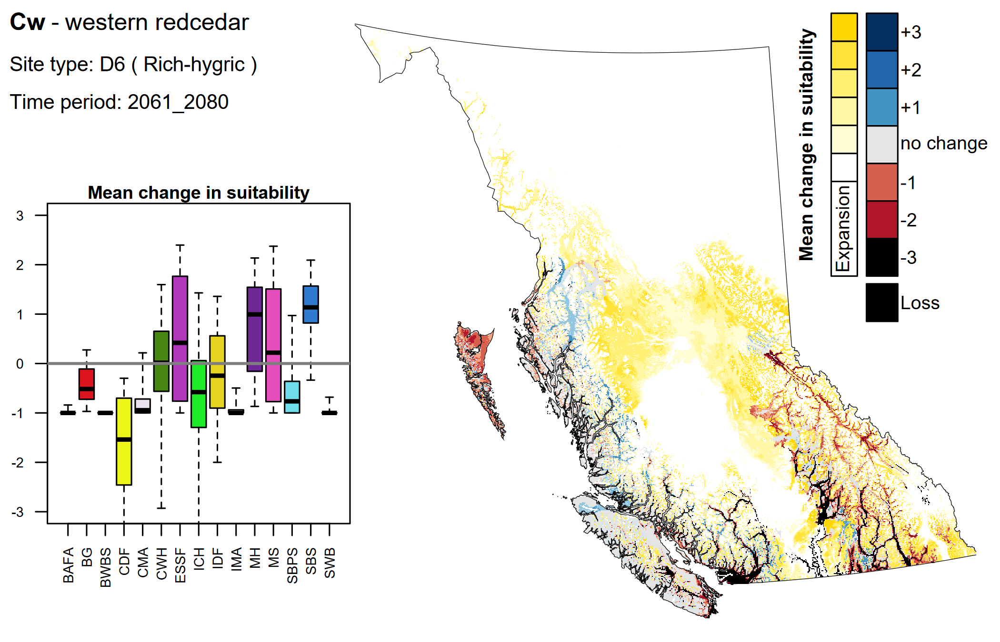
        <figcaption class="small text-muted mt-2">
          Caption for 2061–2080 (D6)…
        </figcaption>
      </figure>
    </div>

    <div class="carousel-item">
      <figure class="m-0">
        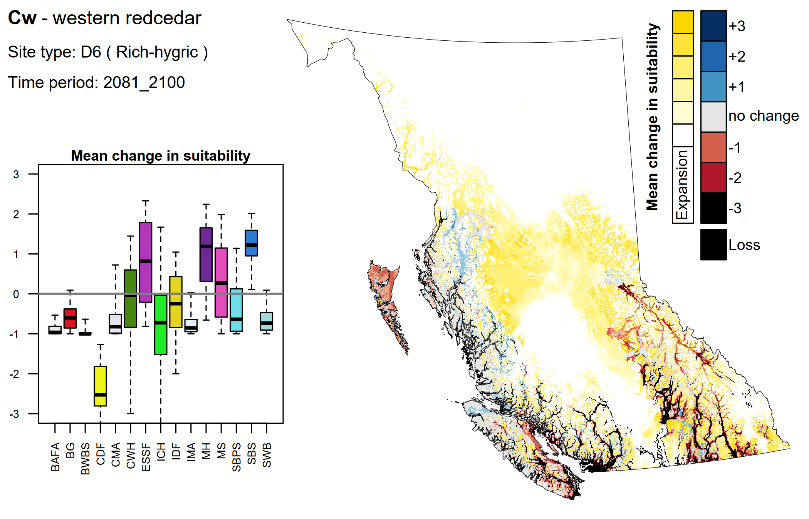
        <figcaption class="small text-muted mt-2">
          Caption for 2081–2100 (D6)…
        </figcaption>
      </figure>
    </div>

  </div>

  <button class="carousel-control-prev" type="button"
          data-bs-target="#d6-carousel" data-bs-slide="prev">
    <span class="carousel-control-prev-icon" aria-hidden="true"></span>
    <span class="visually-hidden">Previous</span>
  </button>

  <button class="carousel-control-next" type="button"
          data-bs-target="#d6-carousel" data-bs-slide="next">
    <span class="carousel-control-next-icon" aria-hidden="true"></span>
    <span class="visually-hidden">Next</span>
  </button>

</div>
```

# Forest health

## Text row

Page describing the potential forest health considerations for each species, as appropriate

**Links:**

[Field Guide to Forest Damage in British Columbia](https://www2.gov.bc.ca/assets/gov/farming-natural-resources-and-industry/forestry/forest-health/forest-health-docs/field_guide_to_forest_damage_in_bc_web.pdf)

[2024 Summary of Forest Health Conditions in British Columbia](https://www2.gov.bc.ca/assets/gov/farming-natural-resources-and-industry/forestry/forest-health/aerial-overview-survey/2024_aos_currentconditions_report.pdf)

# Additional resources

| Resource | Description |
|-------------------------|-----------------------------------------------|
| [Tree Species Compendium](https://www2.gov.bc.ca/gov/content/industry/forestry/managing-our-forest-resources/silviculture/tree-species-selection/tree-species-compendium-index) | Descriptions and characteristics of tree species found in British Columbia and comparison information regarding each species ecological suitability and tolerances to a variety of external factors. |
| Another link | description |
|  |  |
|  |  |
|  |  |
|  |  |
|  |  |
|  |  |
|  |  |
|  |  |
