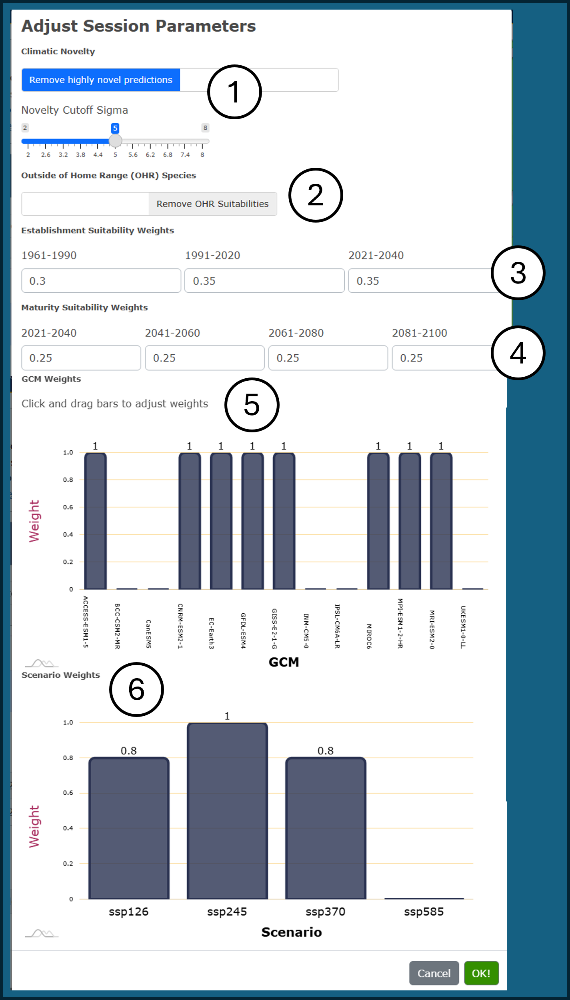

## SELECT SITES:

In the first tab of the CCISS tool, users can select points or areas of
interest, and make manual adjustments to model parameters if necessary.
For a very quick summary of functionality of this page, users can also
click the *What does this page do* link at the top of the left-hand
panel.

## **Step 1.** Select points or areas of interest:

Users can select points or areas of interest using **one of the
following three methods**:

-   **Option 1**. Click on the biogeoclimatic (BGC) map to add one or
    more individual locations. Use this option if you have specific
    sites you are interested in or are exploring CCISS results. Where
    multiple sites are selected, the user can choose to generate a
    report where points are averaged within a BGC unit (default) or for
    each individual site.

-   **Option 2**. Click on the map to choose an entire BGC unit or a BGC
    unit within a single Forest District. The CCISS tool will use a set
    of pre-selected random points for the units chosen. This option is
    to be used where general trends are desired by area. The BGC +
    District option is probably most appropriate for stocking standard
    revisions. To find a specific BGC unit, users can use the
    **Find-a-BEC** drop-down menu at the bottom of the left-hand panel.
    This will highlight the selected unit in yellow, with a red border.

-   **Option 3**. Select a formatted CSV file to upload user-specified
    and named points. The batch file must be in comma-separated (.csv)
    text format specifying a short sitename, latitude, longitude, and
    (optionally) site series (formatted like ICHmc2/01a with no spaces)
    for each site. Batch files of up to 4000 points are supported and
    run at about 20 points/second.

## **Step 2. (Optional)** Select report by individual point or BGC unit average.

Users have the option of selecting to view the CCISS report either by
individual points, or to average across all points in the same BGC unit.
Step 1's *Option 1* and *Option 3* default to individual reports for
each point, while *Option 2* defaults to a BGC unit averaged report. To
change this, users can toggle the slider underneath the big blue
**Generate results** button from *Report by individual sites* to *Report
averaged by BGC*.

## **Step 3. (Optional)** Adjust session parameters

Users can adjust session parameters by clicking on the grey **Model
parameters** button underneath the red **Clear selections** button. A
dialog box appears, with options that allow users to view and adjust the
default settings of the CCISS tool. Users are encouraged to read the
relevant sections of the CCISS tool documentation prior to changing the
default settings. A brief description is also given below.

## **Step 4**. Generate results

Click the big blue **Generate results** button on the left side of the
screen to complete the analysis for the points of interest. If
additional points are added or changes are made to parameters, the
**Generate results** button will change to **Refresh results** to
regenerate the output.   

## <u>More information on adjusting session parameters:</u>

<figure style="text-align:center;">

<figcaption style="font-size: 0.8em; color: gray;">

Figure 1: Example of the dialog box for adjusting **Model parameters**.
Steps 1-6 correspond with the documentation below the figure.

</figcaption>

</figure>

### 1. Climatic novelty

Climatic novelty refers to the degree of mismatch between a future
climate condition and the biogeoclimatic analog it is classified as.
Valid inferences of species suitability are not possible in highly novel
climates. By default, biogeoclimatic projections with high (5$\sigma$)
novelty are removed from CCISS results and replaced with a black bar in
the detailed suitability results. Using the **Model parameters** dialog
box, users can disable the removal of novel climates and adjust the
5$\sigma$ threshold. For more information, see Documentation - Methods -
Novel Climates.

### 2. Outside of Home Range (OHR) suitabilities

CCISS includes environmental suitability ratings for Douglas-fir and
western larch in biogeoclimatic subzone-variants where there is strong
evidence that they were suitable for the baseline 1961-1990 climate
despite not occurring there naturally due to migration lag. Using the
**Model parameters** dialog box, users can disable the inclusion of OHR
suitabilities. See Documentation - Methods - OHR.

### 3. Establishment suitability weights

The suitability report provides an assessment of **establishment
suitability**, representing the likelihood of success in establishing
the species to free growing if planted in the present climate. The
default setting almost equally weights the environmental suitability
(expert derived) in the baseline 1961-1990 climate, and the model
predicted environmental suitability from the observed 2001-2020 climate,
and the projected 2021-2040 climate, with a slight weighting towards the
two most recent time periods. Using the **Model parameters** dialog box,
users can manually adjust these default weightings to suit their needs.
See Documentation - Methods - Rule Sets.

### 4. Maturation suitability weights

The suitability report provides an assessment of **maturation
suitability**: the suitability of the species through the entire future
period to rotation (2021 to 2100). The default setting equally weights
the four 20-year future time periods. Using the **Model parameters**
dialog box, users can manually adjust these default weightings. See
Documentation - Methods - Rule Sets.

### 5. Global Climate Model (GCM) weights

There are 13 GCMs available in the CCISS tool. However, the CCISS tool
defaults to the 8-model ensemble of GCMs recommended by <a href="https://doi.org/10.1002/joc.7566" target="_blank">Mahony et al.
(2022) </a> and assigns each of these
models equal weighting. The other five models were excluded because
their warming rates are not supported by observational evidence
(CanESM5, UKESM1, INM-CM5; explained <a href="https://www2.gov.bc.ca/assets/gov/environment/natural-resource-stewardship/nrs-climate-change/climatena_8modelrationale.pdf" target="_blank">here</a>,
because they only have a single run for each scenario (BCC-CSM2,
INM-CM5), or because they exhibit unrealistic localized warming in BC
(IPSL-CM6A). Using the **Model parameters** dialog box, users can adjust
which GCMs are used and their respective weightings. See Documentation -
Methods - Climate Change Projections.

### 6. Scenario weights

Global climate model projections follow scenarios of future greenhouse
gas emissions called <a href="https://www.carbonbrief.org/explainer-how-shared-socioeconomic-pathways-explore-future-climate-change" target="_blank">Shared Socioeconomic Pathways</a> (SSPs). 
The CCISS tool provides the option of giving different weights
to the four major SSP scenarios: SSP1-2.6, SSP2-4.5, SSP3-7.0, and
SSP5-8.5. Collectively, SSP1-2.6, SSP2-4.5, and SSP3-7.0 provide a
reasonable representation of optimistic, neutral, and pessimistic
outlooks on global emissions policies and socioeconomic development. The
CCISS tool defaults to equal weighting of these three scenarios to
represent scenario uncertainty in climate change projections. We have
set SSP5-8.5 weighting to 0 in the default scenarios because it is
extremely unlikely based on current trends in energy economics and
policy (<a href="https://www.nature.com/articles/d41586-020-00177-3" target="_blank">Hausfather and Peters 2020</a>). Users can
adjust these weightings using the **Model parameters** dialog box. See
Documentation - Methods - Climate Change Projections.

## Example: ICHdw1

In this example, the user has manually selected five points of interest
in the ICHdw1 BGC unit in the Slocan Valley using Option 1 outlined in
Step 1 above. Using the default model parameters and default settings
for reporting, the user will obtain a separate result for each of the
five selected points.

<figure style="text-align:center;">

<figcaption style="font-size: 0.8em; color: gray;">

Figure 2: First panel of CCISS tool with five points selected in the
ICHdw1 BGC unit.

</figcaption>

</figure>
