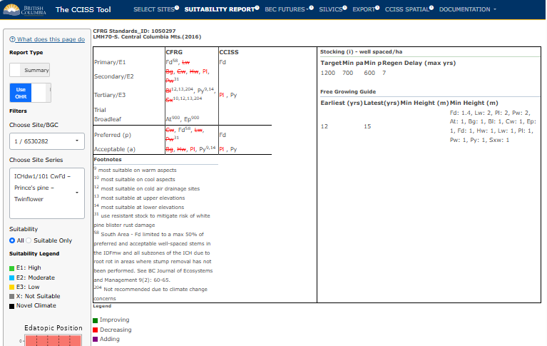

## SUITABILITY REPORT

In this second tab, users can access the main report of the CCISS tool.
The default output is the **Detailed** report, which shows the
distribution of suitability ratings for the global climate model (GCM)
ensemble in each time period. The **Summary** provides a comparison of
the Chief Forester's Reference Guide (CFRG) species ecological
suitability and the CCISS environmental suitability projections. Users
can toggle back and forth between the **Summary** and **Detailed**
version using the slider on the left-hand side of the screen, under
*Report Type* (more detail below).

The concept and definitions of environmental suitability ratings and
their relationship to stocking standards (according to the CFRG) and
CCISS model projections are discussed in more detail in the Suitability
Ratings section of the Methods documentation.

### Selection/Filter pane

In the left pane, users can select the point or BGC subzone-variant and
then the site series of interest. The edatopic space of the selected
site series is displayed in the graphic below for reference (see example
in Figure 1 and 2 below). By default the report will show all species
that are predicted to be suitable in at least one model and time period.
Users have the option to choose the *Suitable Only* option to limit the
list to species that meet the threshold for classification as suitable
across the GCM ensemble in any of the time periods. Users can also opt
to include outside home range (OHR) species here. For more information
on OHR species, visit Documentation - Methods - Outside Home Range.

### Detailed report

The **Detailed** report shows modelled suitability ratios for each
species in the selected site series for each time period. The colour
legend for suitability ratings is on the left hand pane. The mapped BGC
unit represents the historic climate approximated by the climatic
conditions of the 1961-1990 period. The recent time period (2001-2020)
has two bars: one for the observed climate (measured by weather
stations), and one for the climates simulated by the ensemble of GCMs.
These two bars are not necessarily expected to agree: the modelled
climates sample a large range of possible recent conditions, of which
the observed recent climate is only one.

The report then summarizes the historical suitability ratings and CCISS
projected suitability ratings for each species in the following order:

1.  The **CFRG suitability** rating: Ecological suitability ratings for
    a timber objective taken from the Chief Forester's Reference Guide
    for Stocking Standards (CFRG)

2.  The **CFRG P/A** value: Preferred/Acceptable ratings taken directly
    from the CFRG

3.  The **Historical Environmental Suitability**: Expert derived
    baseline (1961-1990) environmental suitability rating for site
    series.

4.  **CCISS Establishment Suitability**: The weighted average
    suitability rating based on the historical environmental suitability
    (1961-1990), and CCISS projected suitability based on recent
    observed (2001-2020), and 2021-2040 future projected climates. This
    indicates the likely level of constraints for successful
    establishment of the species in the present climate. Default model
    settings give roughly equal weight to the three time periods, with
    slightly more weight to the recent (2001+) periods.

5.  **CCISS Maturation Suitability**: The weighted average suitability
    rating projected across the four 20-year normal periods (2021-2100).
    This indicates the inferred suitability of successfully growing an
    established species to maturity (80 years). Default model settings
    equally weight all time periods.

6.  **Trend**: The proportion of the GCM simulations indicating
    improving/stable suitability (numerator) vs. declining suitability
    or remaining unsuitable.

*Reminder:* The weights used to calculate Establishment Suitability and
Maturation Suitability can be modified using the "Adjust Parameters"
dialog box in the "Select Sites" tab.

#### Novel climates

Climatic novelty refers to the difference between future climate
condition and the climate condition of the closest biogeoclimatic
analog. Where future climates are highly novel, i.e. there is
substantial difference between the future climate condition and the
closest analog, there is much higher uncertainty around species
suitability projections. By default, biogeoclimatic projections with
high (5$\sigma$) novelty are removed from CCISS results and replaced
with a black bar in the detailed suitability results. Removal of novel
climates can be disabled or adjusted using the "Adjust Parameters"
dialog box in the "Select Sites" tab. If novel climates are not removed,
the CCISS tool makes the assumption that all future analogs are equal,
despite the novel climates potentially not being good analogs. See
Documentation - Methods - Novel Climates for more details.

### Summary report

This report compares CCISS projected suitability at maturity with the
Chief Forester's Reference Guide ecological suitability. Species codes
are coloured according to trends in their future suitability using the
legend at the bottom of the selection pane: improving (green), or
decreasing (red). Species added to the CCISS projected stocking
standard\* are coloured purple, and species dropped from the CCISS
projected stocking standard *are strike-through.*

\*Note: These are not formally adopted stocking standards by BC Ministry
of Forests.

## Example: ICHdw1 cont.

The following example continues using the five points selected
previously in the *SELECT SITES* Instructions panel of the CCISS tool.
Figure 1 shows the top few lines of the **Detailed** report, when the
default *Remove highly novel climates* is selected through the dialog
box accessed via the **Model Parameters** button, while Figure 2 shows
how this report changes when *No Novelty Analysis* is selected instead.

<figure style="text-align:center;">

<figcaption style="font-size: 0.8em; color: gray;">

Figure 1: Example of a **Detailed** suitability report for the 101 -
CwFd-Prince's pine - Twinflower site series of the ICHdw1 biogeoclimatic
subzone-variant in the Slocan Valley, with the option *Remove highly
novel climates* selected in dialog box accessed through the **Model
parameters** button.

</figcaption>

</figure>

The **Detailed** report (Figure 1) is displaying the results for the 1st
point (1 / 6530760). The seven-digit number here simply refers to the
hex cell that the point is located in. In this example, we have selected
the ICHdw1/101 CwFd - Prince's pine - Twinflower site series. We can see
from the bars under *Modelled Suitability* that for **Fd**
(Douglas-fir), the mapped (historic: 1961-1990) suitability was E1: High
(Documentation - Methods - Suitability Ratings). Accordingly, the CFRG
rates Fd **1** for *Primary* and **P** for *Preferred* at this site. The
CCISS tool projections resulted in an E1 rating at *Establishment*, and
an E2 (moderate) at *Maturity*. The modelled suitability ratios *Trend*
shows that 87 percent of model "votes" suggested that the suitability of
**Fd** would either improve or stay the same, and 13 percent suggested a
decline in suitability.

If we return to the bar chart, under the "Mapped" bar, we see the two
bars that represent the recent time period (2001-2020). From this, we
can see that the weather station data (obs) and the climates simulated
by the ensemble of GCMs (mod) are in agreement that Fd has been a highly
suitable (E1) species at this location.

The CCISS tool then allows us to evaluate the future projected
environmental suitability of the tree species. We see that in the first
of the future periods (2021-2040), there is not much change in the
suitability of **Fd**. However, in the next three future periods
(2041-2060, 2061-2080, and 2081-2100), we can see the introduction of
novel climates. These are climates for which there is no good
analog in the pool of Western North America historical climates. See
Documentation - Methods - Novel Climates for more information. Since the
climate in this region is projected to be distinct from other BGC
analogs in Western North America, we do not know how well Douglas-fir
will fare in these conditions, which means there is increased
uncertainty around future suitability. Overall, the CCISS tool suggests
that **Fd** will remain suitable to future climate at this location, with
some caution around unknown suitability under novel future climate.

The next species on the list is **Lw** (western larch). The outlook for
this species is more unfavourable than for **Fd**. As can be seen by the
green E1 bar for "Mapped", **Lw** was highly suitable under historical
environmental conditions in this BGC unit, and rated primary (1) by the
CFRG. However, the two bars for the recent period (2001-2020)
demonstrate decreasing suitability to E2. CCISS projections suggest that
as early as the current (2021-2040) time period, this suitability will
drop to an E3. By the end of the century, only 17% of models suggest an
E3 rating for this species, with 31% predicting unsuitable, and the rest
falling into a novel climate where we do not know how **Lw** will
respond. This information suggests that **Lw** is a highly risky species
to plant in the ICHdw1/101.

<figure style="text-align:center;">

<figcaption style="font-size: 0.8em; color: gray;">

Figure 2: Example of a **Detailed** suitability report for the 101 -
CwFd-Prince's pine - Twinflower site series of the ICHdw1 biogeoclimatic
subzone-variant in the Slocan Valley, with the option *No Novelty
Analysis* selected in dialog box accessed through the **Model
parameters** button.

</figcaption>

</figure>

In Figure 2, we see the impact that selecting "No Novelty Analysis" has
on our results. In this scenario, the CCISS tool does not remove highly
novel predictions, instead displaying all BGC projections including
those that may not be good analogs. As a result, the CCISS gives us a
more confident answer about the suitability of **Fd**, suggesting that
its suitability until 2100 will remain fairly stable. In this example,
the projected BGCs associated with novel climate contain an **Fd**
species suitability rating of E1. Therefore, it promotes the Maturity
Suitability to an E1, whereas in Figure 1, we see that it was demoted to
an E2 due to the greater proportion of unsuitable (X) ratings in
relation to suitable (E1) ratings. In Figure 2, the modelled suitability
ratios show that 92 percent of model "votes" suggested that the
suitability of Fd would either improve or stay the same, and 8 percent
suggested a decline in suitability. Removing highly novel predictions
represents a more conservative or cautious approach.

<figure style="text-align:center;">

<figcaption style="font-size: 0.8em; color: gray;">

Figure 3: Example of a suitability **Summary** report for ICHdw1/101,
which shows the difference between the CCISS projected environmental
suitabilities and the original ecological suitability proposed by the
Chief Forester's Reference Guide.

</figcaption>

</figure>

Finally, we see an example of a **Summary** report (Figure 3). This
feature allows the user to explicitly compare CCISS results with those
of the CFRG. The species shown in [red]{style="color:red"} text are
decreasing in suitability. Those that are crossed out have, on average,
across all time periods, GCMs, and SSPs, decreased so much that they are
now predicted to be unsuitable. Species marked in
[green]{style="color:darkgreen"} are improving in suitability, but none
of those exist in the current example. Finally, if the user was to
switch to *No Novelty Analysis* in the **Select Sites** tab, under
**Model Parameters**, they would see some species show up here in
[purple]{style="color:purple"} (Adding). Purple species are those that
were not included in the CFRG because they were historically unsuitable
here, but CCISS predicts future climates in which they could be
suitable.

In this case, we see that only two species remain suitable according to
the CCISS projections **Fd** (E2) and **Py** (E3). **Py** (Ponderosa
pine) is another interesting example, because the displayed projections
(i.e. not novel climate) predict a divergence in suitability (E1, E3 and
unsuitable), tending towards an increase in suitability over time and
averaging to an E3 rating (Figure 4). This species has 80 percent of
model "votes" suggesting increasing/maintained suitability, and only 20
percent suggest a decrease. However, much of the future climate is novel
and there is a high degree of uncertainty around the future suitability
of Py.

Note on footnotes: **Py** has footnote 9 in the CFRG, which corresponds
to *most suitable on warm aspects*. This is where applying expert
knowledge to CCISS results is key, because under warmer future climate,
it might actually be more suitable on cooler aspects instead.

<figure style="text-align:center;">

<figcaption style="font-size: 0.8em; color: gray;">

Figure 4: Suitability report for Ponderosa pine (Py) in this example
scenario for ICHdw1/101.

</figcaption>

</figure>

##### References:

Chief Forester's Reference Guide:
<https://www2.gov.bc.ca/gov/content/industry/forestry/managing-our-forest-resources/silviculture/stocking-standards>
