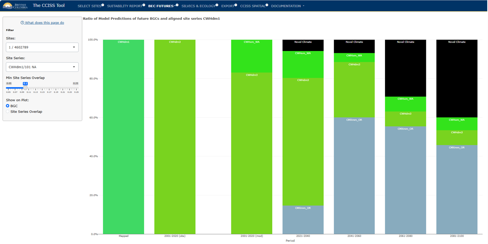
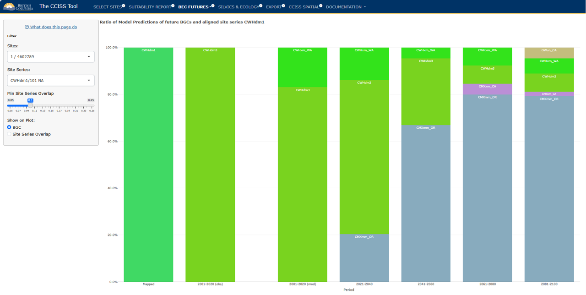
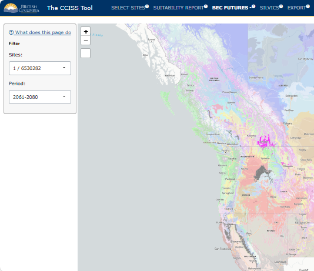

## BEC FUTURES:

This section summarizes the biogeoclimatic (BGC) projections that
underlie the species suitability forecasts. Biogeoclimatic
subzone/variants (a.k.a. BGC units) are the climate component of the
Biogeoclimatic Ecosystem Classification (BEC). Each user-selected
location has a mapped BGC unit representing its historical climate.
Biogeoclimatic projections identify a BGC unit whose historical climate
is the best match (best analog) for the future climate at a
user-selected location. In other words, changes in climatic conditions
(temperature, precipitation, etc) are translated into a change in the
BGC unit.

### Chart

Users can view the chart mode, which displays a stacked bar chart
showing the ratio of future BGC analogs by time period predicted across
a range of global climate model-scenario climate projections. Hovering
over a stacked bar will display these proportions numerically.

The recent time period (2001-2020) has two bars: one for the observed
climate (measured by weather stations and interpolated across the
province), and one for the modelled climates (simulated by global
climate models). These two aren't expected to agree: the modelled
climates sample a large range of possible recent conditions, of which
the observed recent climate is only one.

The default mode of this plot simply shows the BGC analog labels. Users
can specify a site series of interest and select "Site Series Overlap"
on the lefthand pane, which will display the site series in the BGC
analog that overlap with the edatopic position of the historic site
series, along with the proportion of the edatopic overlap. The "minimum
site series overlap" slider allows the user to include or exclude site
series with small edatopic overlaps.

### Map

After switching to the **Map** tab in the drop-down menu under **BEC
Futures**, users can select the site or area of interest from the drop
down menu and then select a future time period. The map will highlight
the historical BGC unit in colour (pink) and the projected BGC analogs
in grey. Darker greys indicate a higher proportion of global climate
model projections matched that BGC analog.

## Example: ICHdw1 cont.

Continuing on with the example of the ICHdw1 - Interior Cedar-Hemlock -
West Kootenay Dry Warm, in the Slocan Valley, we can see the projected
BGC units that inform changes to species suitability (See Suitability
Report tab), displayed as stacked bar charts by selecting **Charts**.

Note: See Documentation - Definitions - BEC Codes for the biogeoclimatic
zone and subzone names.

<figure style="text-align:center;">

<figcaption style="font-size: 0.8em; color: gray;">

Figure 1: Stacked bar chart showing the mapped (historic) BGC unit, the
BGC unit(s) associated with observed/modelled (2001-2020) climate, as
well as the ratio of future BGC climate analogs predicted by CCISS. This
version of the chart was created with the default setting for climate
novelty in the **Select Sites** tab (*Remove highly novel climates*).

</figcaption>

</figure>

We can see that the future climate of the ICHdw1 in the Slocan Valley is
predicted to much more closely resemble climates historically found in
Washington, Oregon, and California. In the recent period's modelled
results, most 'votes' agree with the observed weather data that the
climate most closely resembled that of ICHxw (Interior Cedar-Hemlock
very dry warm) between 2001 and 2020. In the 2021-2040 time period, the
IDFww (Interior Douglas-fir wet warm) becomes the dominant climate
analog, and novel climates begin to appear. By the 2081-2100 period, the
CMXxm_CA (Coastal Mixed Evergreen very dry mild California) becomes the
BGC unit with the most votes. The historical analog for this climate is
found in the foothills of the Sierra Nevada mountains in California
(Figure 3), and it is much warmer than the historical climate in the
Kootenays.

<figure style="text-align:center;">

<figcaption style="font-size: 0.8em; color: gray;">

Figure 2: Stacked bar chart showing the mapped (historic) BGC unit, the
BGC unit(s) associated with observed/modelled (2001-2020) climate, as
well as the ratio of future BGC climate analogs predicted by CCISS. This
version of the chart was created by changing the setting for climate
novelty in the **Select Sites** tab to *No Novelty Analysis*.

</figcaption>

</figure>

When we ignore climate novelty and consider all analogs as equal, we see
quite a different future, with a dominance of the CWFdm_OR (Coastal
White Fir dry mild Oregon) in the 2041-2060, 2061-2080, and 2081-2100
periods.

<figure style="text-align:center;">

<figcaption style="font-size: 0.8em; color: gray;">

Figure 3: Map highlighting the historical BGC unit - ICHdw1 - in pink,
and the future BGC analogs in grey.

</figcaption>

</figure>

Finally, in Figure 3, we see the location of the ICHdw1 in pink and the
locations of the projected BGC analogs highlighted in grey.
