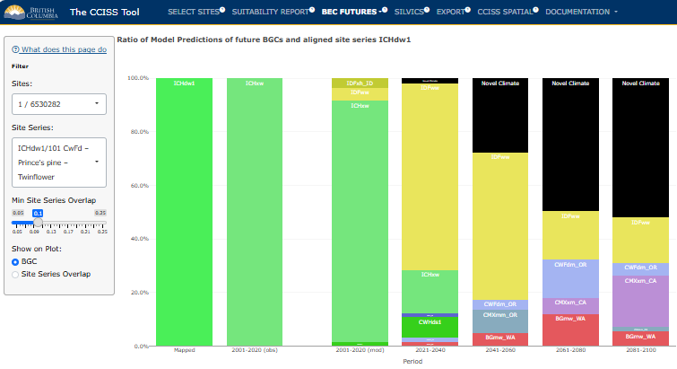

## BEC FUTURES:

This section summarizes the biogeoclimatic (BGC) projections that underlie the species suitability forecasts. Biogeoclimatic subzone/variants (a.k.a. BGC units) are the climate component of the Biogeoclimatic Ecosystem Classification (BEC). Each user-selected location has a mapped BGC unit representing its historical climate. Biogeoclimatic projections identify a BGC unit whose historical climate is the best match (best analog) for the future climate at a user-selected location. In other words, changes in climatic conditions (temperature, precipitation, etc) are translated into a change in the BGC unit.

### Chart

Users can view the chart mode, which displays a stacked bar chart showing the ratio of future BGC analogs by time period predicted across a range of global climate model-scenario climate projections. Hovering over a stacked bar will display these proportions numerically.

The recent time period (2001-2020) has two bars: one for the observed climate (measured by weather stations and interpolated across the province), and one for the modelled climates (simulated by global climate models). These two aren't expected to agree: the modelled climates sample a large range of possible recent conditions, of which the observed recent climate is only one.

The default mode of this plot simply shows the BGC analog labels. Users can specify a site series of interest, which will display the site series in the BGC analog that overlap with the edatopic position of the historic site series, along with the proportion of the edatopic overlap. The "minimum site series overlap" slider allows the user to include or exclude site series with small edatopic overlaps.

### Map

After switching to the **Map** tab in the drop-down menu under **BEC Futures**, users can select the site or area of interest from the drop down menu and then select a future time period. The map will highlight the historical BGC unit in colour and the projected BGC analogs in grey. Darker greys indicate a higher proportion of global climate model projections matched that BGC analog.

## Example: CWHdm1 cont.

Continuing on with the example of the CWHdm1/101 of the Slocan Valley, we can see the reason for the differences in species suitability when we look at the stacked bar charts provided by selecting **Charts**. 

<figure style="text-align:center;">
  
  <figcaption style="font-size: 0.8em; color: gray;">Figure 1: Stacked bar chart showing the mapped (historic) and observed (2001-2020) BGC unit, as well as the ratio of future BGC climate analogs predicted by CCISS. This version of the chart was created with the default setting for climate novelty in the **Select Sites** tab (*Remove highly novel climates*).   </figcaption>
</figure>

We can see that the climate in this site series of the Slocan Valley is predicted to much more closely resemble previously unfamiliar climates historically found in Washington, Oregon, and California. In the recent period's modelled results, most 'votes' agree with the observed weather data that the climate most closely resembled that of ICHxw between 2001 and 2020. In the 2021-2040 time period, the IDFww becomes the dominant climate analog, and novel climates begin to appear. By teh 2081-2100 period, the CMXxm_CA becomes the BGC unit with the most votes. The historical analog for this climate is found in the foothills of the Sierra Nevada mountains in California (Figure 3), and it is much warmer than the historical climate in the Kootenays. 

<figure style="text-align:center;">
  
  <figcaption style="font-size: 0.8em; color: gray;">Figure 2: Stacked bar chart showing the mapped (historic) and observed (2001-2020) BGC unit, as well as the ratio of future BGC climate analogs predicted by CCISS. This version of the chart was created by changing the setting for climate novelty in the **Select Sites** tab to *No Novelty Analysis*.   </figcaption>
</figure>

When we ignore climate novelty and consider all analogs as equal, we see quite a different future, with a dominance of the CWFdm_OR in the 2041-2060, 2061-2080, and 2081-2100 periods. 

<figure style="text-align:center;">
  
  <figcaption style="font-size: 0.8em; color: gray;">Figure 3: Map highlighting the historical BGC unit - the CWHdm1 - in pink, and the projected BGC analogs in grey.   </figcaption>
</figure>

Finally, in Figure 3, we see the locations of the historical analogs highlighted in grey, and the locations of the CWHdm1 in pink. 