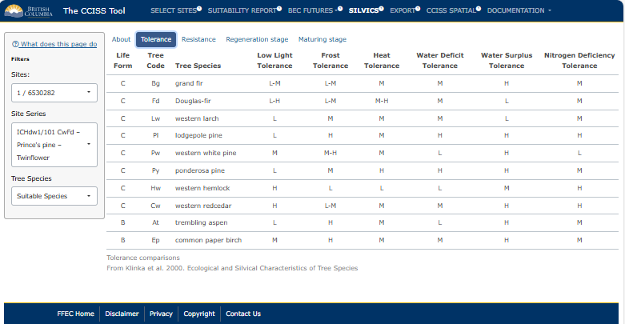

## SILVICS

This section contains information that may be useful for interpreting CCISS results and making management decisions. More information can be found in the **About** tab of this section. 

This module summarizes the silvics of each species with historic or future suitability in the selected BGC unit and site series. This information is drawn from Klinka et al. (2000). This information can be explored further at this <a href="https://www2.gov.bc.ca/gov/content/industry/forestry/managing-our-forest-resources/silviculture/tree-species-selection/tool-introduction/tree-species-silvics-and-comparisons" target="_blank">link</a>.

## Example: ICHdw1 cont.

Here's what the output from the **Silvics** tab would look like given the example in the ICHdw1. The user can select the site series within the BGC subzone/variant, and select whether they want to see the Klinka et al. (2000) information for just suitable species, or for all species.

<figure style="text-align:center;">

<figcaption style="font-size: 0.8em; color: gray;">

Figure 1: Example of the information provided by Klinka et al. (2000) for tolerance of species in the ICHdw1/101.

</figcaption>

</figure>

##### References: 

Klinka, K., J. Worrall, L. Skoda, and P. Varga. 2000. The Distribution and Synopsis of Ecological and Silvical Characteristics of Tree Species of British Columbia’s Forests. Canadian Cartographics Ltd., Coquitlam, B.C. 