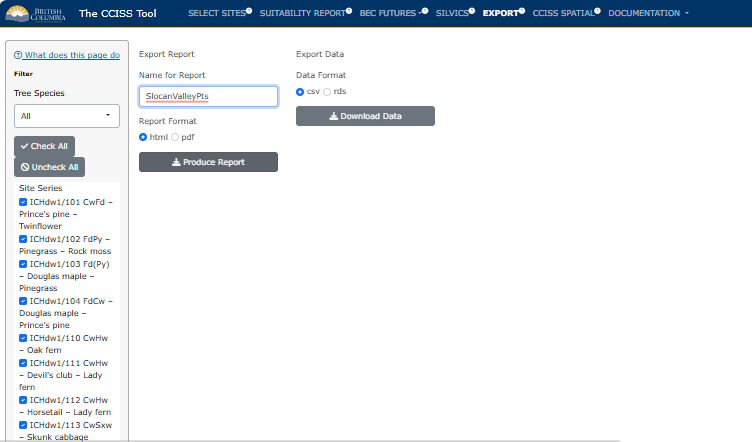

## EXPORT

#### Export Report

The report is designed for documentation and off-line use of a CCISS tool report session, for example, as an appendix to a site plan. We recommend including only the site series of interest to the user. Choose the "Suitable Only" option to limit the list to species that meet the threshold for inclusion as suitable in any of the time periods.

#### Export data

Suitability data can be exported for conducting further analyses such as calculating summary statistics for your area of interest. Suitability data exported from the CCISS tool is in "long form" with each row showing projected suitability by site of interest, site series, and tree species. Data are exported as a .CSV file; a PDF metadata report is included in the export folder.

## Example: ICHdw1 cont.

Continuing with our example in the ICHdw1, here's what the **Export** page would look like. 
<figure style="text-align:center;">

<figcaption style="font-size: 0.8em; color: gray;">

Figure 1: Example of how a user could save data using the Export functionality in CCISS.

</figcaption>

</figure>