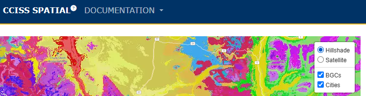
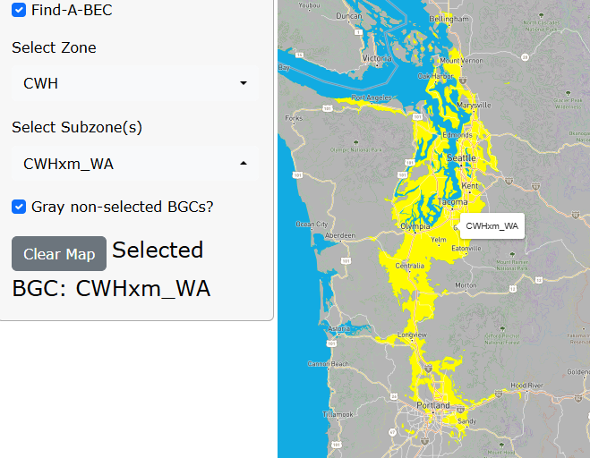
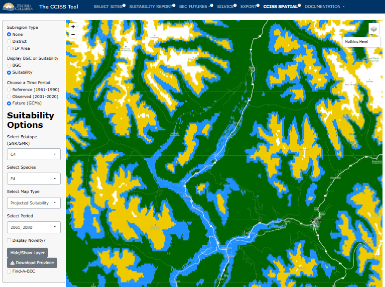

## CCISS SPATIAL 

The spatial module of the CCISS tool allows users to explore CCISS data inputs and put CCISS results into spatial context. 

Functionality of the CCISS spatial module includes: 

-	Maps of biogeoclimatic projections for the ensemble and for five representative GCM simulations; 
-	Maps of tree species environmental suitability projections for three site types (i.e., edatopes);
-	Overlays of climatic novelty for each biogeoclimatic or suitability projection;
-	Pop-up interactive plots on user-selected locations ;
-	Interactive plots of biogeoclimatic and suitability changes within user-selected subregions;
-	Downloads of spatial data for active map layer at 200m raster resolution; and 
-	Find-A-BEC for locating specified biogeoclimatic units of Western North America. 

### Subregion type

The options for Subregion type are “None”, BC Natural Resource Districts, and Forest Landscape Planning (FLP) areas. We currently provide functionality for 10 FLP areas; we will add more as they become publicly available. When a subregion is clicked on the map, an interactive plot appears to the right of the map. The plot shows ensemble mean changes in biogeoclimatic unit area or species suitability; lines on the map can be clicked to show the ensemble variation. 

### Display BGC or Suitability

Select whether the map displays biogeoclimatic (BGC) units or species suitability. Subsequent dialogue boxes are customized for each of these two modes, as described below. 

### BGC mode 

Select reference period (baseline) historical climate, observed recent climate (2001-2020), or future climates. 

-	When reference (1961-1990) is selected, there is the option of selecting `Mapped or Predicted`. The `Mapped` BGC units are a rasterization of the official linework of BEC version 13. The `Modeled` BGC units are the prediction of the biogeoclimatic model used to generate the CCISS projections. These are different because the model is trained with a sample of locations from each biogeoclimatic unit, and hence is not expected to perfectly reproduce the official linework. 
-	When `Future (GCMs)` is selected, `Select GCM` controls whether the map shows ensemble results or individual GCM simulations. `SZ_Ensemble` displays the *biogeoclimatic subzone/variant* with the highest number of votes across the ensemble of 60 simulations (i.e., the ensemble vote winner); `Zone_Ensemble` shows the *biogeoclimatic zone* with the most votes. These may be different because votes for the highest-voted subzone variant may be outnumbered by votes for multiple subzone/variants from another biogeoclimatic zone. To see what the breakdown of votes was for any given location, users can click on the map, and a pop-up will appear with stacked bars showing the percent of votes for each BGC unit in each time period. For more information, see the example at the bottom of this page. 

- Regional summaries can be viewed by selecting `District` or `FLP Area` from the left-hand panel, and clicking on the area of interest on the map. A box will appear on the right-hand panel of the screen, where users can adjust the x-variable of interest (time, MAT, MAP, CMD, or DD5). Users can also select whether they want to summarize by zone, and if they want to show the 2001-2020 observed period as points on the resulting plot. 

### Suitability mode 

Throughout Suitability mode, there is the option of choosing a representative edatope (site type) and tree species.  

-	`Select Edatope (SNR/SMR)` provides the option of B2 (nutrient-poor, subxeric), C4 (nutrient-medium, mesic), or D6 (Nutrient-rich, hygric). Displaying all 35 edatopes is computationally infeasible, so we chose these three edatopes to represent distinct, common site types.  
-	`Select species` allow selection of common native tree species of BC. We will add more species in the future. Codes for each species are defined in Documentation>Definitions>SpeciesCodes. 

When `Observed (2001-2020)` or `Future (GCMs)` is selected, there is the option of mapping `Projected Suitability` or `Suitability Change`.

-	`Projected Suitability` displays the CCISS environmental suitability rating for the selected time period. The meanings of these ratings are defined in Documentation>Methods>SuitabilityRatings. 
-	`Suitability Change` displays the change in suitability relative to the mapped reference period (1961-1990) suitability rating. Suitabilities in historically unsuitable locations are mapped in yellow to differentiate this suitability range expansion from increases in suitability within the historically suitable range of the species. 

#### Suitability pop-up plot

When a location on the suitability map is clicked, a pop-up is activated providing interactive 2D plots of the change in biogeoclimatic analogs and species suitability over time at that location. There may be more than one suitability rating for individual biogeoclimatic units because in some cases the selected edatope is shared by two site series with different suitability ratings (see Documentation>Methods>EdatopicOverlap). 

### Display Novelty

In BGC or Suitability mode, the `Display Novelty?` checkbox overlays a map of estimate climatic novelty. High climatic novelty (>5σ, red colors) indicates that the biogeoclimatic subzone/variant identified by the biogeoclimatic model is a very poor analog for the future climate condition, even though it is the best available. The CCISS tool uses a default dissimilarity threshold of 5-sigma (5σ) to infer a novel climate and discard the biogeoclimatic analog. Novelty in the 3-5σ  range can be interpreted as a poor analog. In this range, species suitability inferences may be useful but are also likely to be somewhat misleading. The methods and interpretation of climatic novelty are explained in Documentation>Methods>NovelClimates

#### Novelty pop-up plot

When a location on the novelty map is clicked, a pop-up is activated providing an interactive 3D plot comparing future climates to the historical climate of the analog. click and drag to spin the plot. This plot is the same for all locations that have the same biogeoclimatic analog for the selected GCM and time period. Blue dots are the spatial variation in baseline (1961-1990) climates of the analog. Black dots are the 1951-1990 interannual variability of the analog. Filled circles are projected climates of locations in British Columbia that are assigned the analog by the BGC model, with colours indicating sigma novelty consistent with the map legend. The axes of the plot are principal components (PCs) of analog variation, with PC1 being the axis with the most variation in the plotted points, and PC3 having the least. Labelled lines indicate correlations of the input variables with the 3 PCs that comprise the viewspace.

### Hide/Show Layer

This button removes the CCISS layer to reveal the basemap. This is useful for comparing the CCISS maps to the topography, satellite photo, or baseline BGC linework. These basemaps can be selected in the top right of the map: 

<figure style="text-align:center;">

  
<figcaption style="font-size: 0.8em; color: gray;">

Figure 1: Demonstration of how basemaps can be selected in CCISS spatial. 

</figcaption>

</figure>

### Find-A-BEC
The `Find-A-BEC` feature helps with locating specified biogeoclimatic units of Western North America. Select the BGC zone of interest and then use `Deselect All` to select a subset of subzone/variants within that zone. Applying the `Gray non-selected BGCs` checkbox assists with finding the selected unit(s). 

<figure style="text-align:center;">

<figcaption style="font-size: 0.8em; color: gray;">

Figure 2: Demonstration of the Find-a-BEC function in CCISS spatial. 

</figcaption>
</figure>

### Export data from **CCISS Spatial**: 

Data from **CCISS Spatial** are downloadable as raster files. Users can opt to download data for the whole province by clicking on the gray **Download Province** button at the bottom of the left-hand panel, or they can select a specific district or FLP area in the same panel. If they select a district or FLP area of interest, a pop up appears on the right-hand side (also where users can view the regional summaries). Here, users can download the raster file of the map they are currently viewing. 

## Example: ICHdw1 cont.

Throughout the **Instructions**, we have been following an example of the ICHdw1 in the Slocan Valley of BC. Here, we see what the BGC analogs of this area are projected to be.   

<figure style="text-align:center;">

<figcaption style="font-size: 0.8em; color: gray;">

Figure 3: BGC projections - SZ_Ensemble, which displays the *biogeoclimatic subzone/variant* with the highest number of votes across the **small** ensemble of simulations (i.e., the ACCESS-ESM1-5, EC-Earth3, GISS-E2-1-G, MIROC6, and MPI-ESM1-2-HR). At the point of interest (black dot) added here, the ensemble vote winner (i.e., BGC unit with the most "votes", is CWFdm_OR). 

</figcaption>

</figure>

<figure style="text-align:center;">

<figcaption style="font-size: 0.8em; color: gray;">

Figure 4: BGC projections - ZONE_Ensemble, which displays the *biogeoclimatic zone* with the highest number of votes across the **small** ensemble of simulations (i.e., the ACCESS-ESM1-5, EC-Earth3, GISS-E2-1-G, MIROC6, and MPI-ESM1-2-HR). At the point of interest (black dot) added here, it is the CWF zone.

</figcaption>

</figure>

<figure style="text-align:center;">

<figcaption style="font-size: 0.8em; color: gray;">

Figure 4: Still centered around the Slocan Valley, this map shows projected future suitabilities for Fd (Douglas-fir) in the 2061-2080 future period. Green is E1: High, blue is E2: Moderate, yellow is E3: Low, and white is unsuitable.  

</figcaption>

</figure>

<figure style="text-align:center;">

<figcaption style="font-size: 0.8em; color: gray;">

Figure 5: Instead of showing suitability, this map shows the change in suitability, as compared to the historic period (1961-1990).

</figcaption>

</figure>

<figure style="text-align:center;">

<figcaption style="font-size: 0.8em; color: gray;">

Figure 6: Degree of climate novelty. Red is very high novelty (>5σ) and represents a very bad analog, yellow is high novelty (3-5σ) and represents a poor analog, and white represents areas without novel climates.

</figcaption>

</figure>
