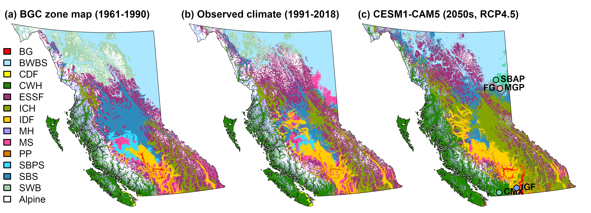
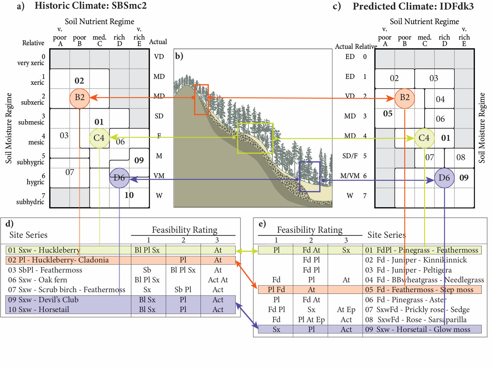

## Overview of CCISS Methods

The CCISS method can be summarized into two main steps:

-   **Step 1---Biogeoclimatic projections**---Use a statistical model to
    assign climate analogs for a large ensemble of projected future
    climates for each location in British Columbia;

-   **Step 2---Cross-reference tree species suitability**---For each
    site series at user-specified locations of interest, find the tree
    species environmental suitability ratings of the equivalent site
    series in the ensemble of climate analogs.

### Step 1: Biogeoclimatic projections

CCISS uses spatial climatic analogs to make inferences about future tree
species suitability. A spatial climate analog is a location with a
historical climate that is similar to the current or future projected
climate of a different location. Biogeoclimatic subzone/variants are a
uniquely useful set of spatial climate analogs because they are familiar
to resource management practitioners and are the organizing units for
site-specific ecological interpretations accumulated over many decades.

In the CCISS framework, biogeoclimatic analogs are identified by
training a statistical or machine learning model to recognize
biogeoclimatic subzone-variants (i.e., BGC units) in terms of their historical 
(1961-1990) climatic conditions, and then applying that classification model to 
new (current or projected) climate conditions (MacKenzie and Mahony 2021).
The new climates are thus labelled using their best analog within the
BEC system, a process called biogeoclimatic projections (Figure 1).

To represent the uncertainty in modeling future climates, CCISS
incorporates biogeoclimatic projections for 72 climate model simulations
of the 21st century (8 climate models x 3 simulation runs x 3
socioeconomic scenarios).

Figure 1: An example of biogeoclimatic projections for British Columbia,
excerpted from Mackenzie & Mahony (2021) (a) is the biogeoclimatic
mapping for BC; (b) and (c) are biogeoclimatic projections for recent
observed climate and a global climate model projection for the 2041-2070
period.

### Step 2: Cross-reference tree species suitability

Step 2 involves finding the tree species suitability information for the
climate analogs identified by step 1. For each user-specified location
at each 20-year period of the 21st century, the CCISS tool provides a
historical biogeoclimatic unit and an ensemble of biogeoclimatic
analogs. In the example provided in Figure 2, the historical climate is
SBSmc2, and the climate analog for the projected future climate is
IDFdk3. Both of these BGC units have associated site series, distributed
across their unique edatopic grids. Each of these site series has
associated tree species suitability ratings. The CCISS analysis adopts
the suitability ratings of the biogeoclimatic analog as the projected
suitability for that time period. In this example, on the 01 site
series, spruce (Sx) and subalpine fir (Bl) are demoted while Douglas-fir
(Fd) and trembling aspen (At) are promoted. Since there is an ensemble
of 72 climate projections, the CCISS suitability projections at each
time period are typically a distribution indicating the uncertainty in
climate futures.

Figure 2: Illustration of the CCISS method of using climate analogs to
project site-specific changes in tree species suitability, excerpted
from Mackenzie & Mahony (2021). (b) An idealized slope profile
illustrates that, within each biogeoclimatic subzone/variant (a climate
type), the relative soil moisture and nutrients available for tree
growth are moderated by site factors such as soil depth, soil parent
materials, slope position and slope aspect. (a,c) Edatopic grids show
the integrated effect of site factors on soil moisture regime (rows) and
soil nutrient regime (columns). The cells of the edatopic grid are
called edatopes. Three of the 40 possible edatopes are featured in this
figure: the B2 edatope representing nutrient-poor and relatively dry
(subxeric) sites; the C4 edatope representing nutrient-medium and
moisture-average (mesic) sites; and the D6 edatope representing
nutrient-rich and relatively moist (hygric) sites. Site series are
groups of edatopes that can support the same mature plant communities.
(a,b,c) Relative edatopic position does not change with changing
climate, allowing equivalent site series and associated tree suitability
ratings to be aligned between historical and projected climates. (d,e)
Tree species environmental suitability ratings have been developed for
all site series in each biogeoclimatic unit through expert knowledge.
Equivalent relative edatopes support different tree species under
different climate regimes.

### Further reading:

The other tabs in this section provide more detail on the methods
underlying the CCISS tool:

-   BEC---Basics of the Biogeoclimatic Ecosystem Classification and the
    draft classifications for the US and Alberta
-   Suitability Ratings---Definitions of the tree species environmental
    suitability ratings.
-   Climate Change Projections---Details on the ensemble of climate
    model projections.
-   BGC Model---Explanation of biogeoclimatic projections and guidance
    on interpreting them.
-   Novel Climates---Measuring how well biogeoclimatic analogs match
    current and future climates.
-   Edatopic Overlap---Methods for aligning site series of the
    historical and analog BGC units.
-   Rule Sets---Rules for synthesizing the suitability projections into
    species-specific summary values for each site series.
-   OHR suitabilities---Baseline suitability ratings for tree species
    outside their home range.

##### References: 

MacKenzie, W.H. and C.R. Mahony. 2021. <a href="./downloadable_docs/MacKenzieMahony2021_CCISS_FEM.pdf" target="_blank">An ecological approach to
climate change-informed tree species selection for
reforestation </a>. Forest Ecology and Management 481:118705
