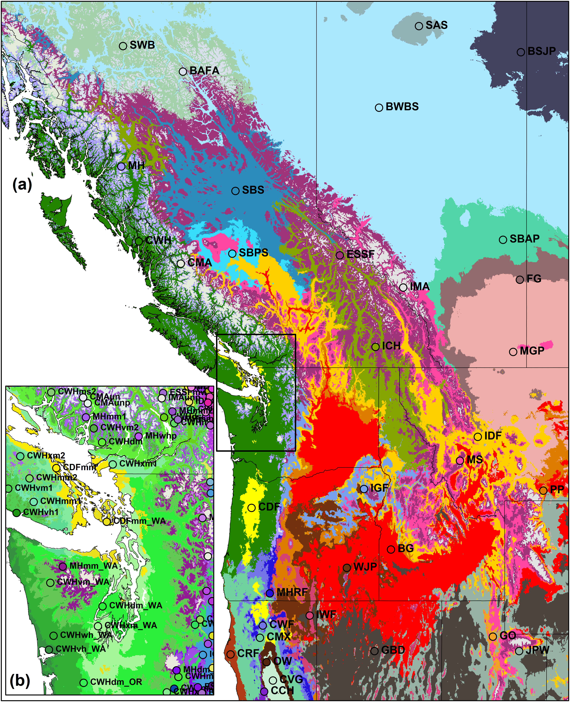
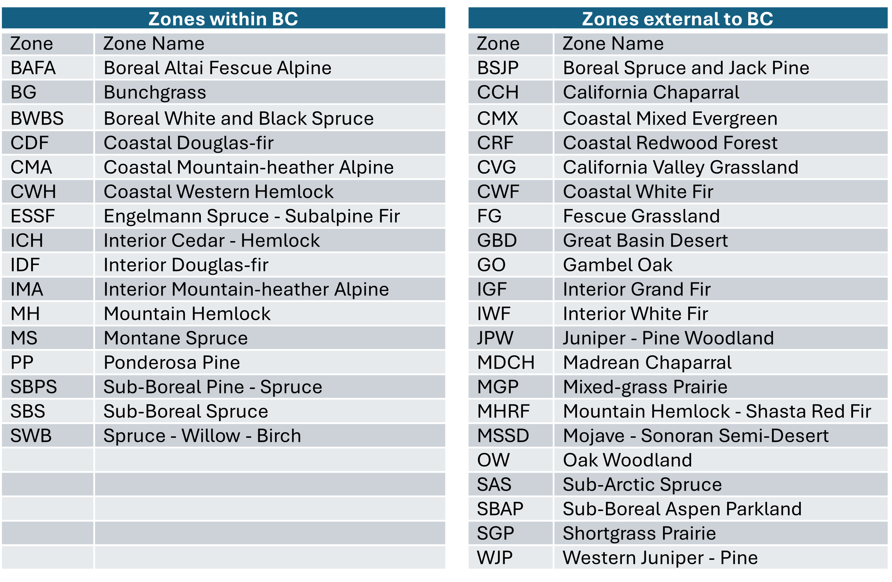

### Biogeoclimatic Ecosystem Classification (BEC)

In British Columbia, tree species selection for reforestation has
followed an ecological approach since the adoption of the Biogeoclimatic
Ecosystem Classification (BEC) by the provincial government in 1976. BEC
is best described as an ecological classification framework that uses
units of a plant community classification to identify and delineate
ecologically equivalent climatic regions and site environmental
conditions. The classification approach has hierarchical components
describing climate and site level differences each based on biological
(vegetation) differentiation:

-   **Biogeoclimatic units** are a specific type of bioclimate unit
    where the units are defined and differentiated based on mature plant
    associations that occur on specific site conditions known as zonal
    sites. Zonal sites are those positions on the landscape which best
    reflect climatic conditions: neutral aspect, deep loamy soils,
    middle slope position, mesic/medium edatopic position.
    Biogeoclimatic zones describe areas where zonal sites are dominated
    by specific late seral tree species (for forested units) reflecting
    broad climatic differences. Subzone/variants differentiate areas
    within zones by the late seral plant association of the zonal site.
    These more fine-grained units reflect variations in the regional
    climate and tree species composition of zones and define areas of
    ecologically equivalent climate space.

-   The **site series** describes the site-level ecological variability
    within each BGC subzone/variant. Predictably repeating patterns of
    site series occur on different site conditions as evidenced by
    changes in late seral plant community composition. Sites that
    support similar mature plant communities are considered ecologically
    equivalent and treated as members of the same site series. An
    independent set of observations of soils and site conditions are
    made during plot collection to determine its relative position on
    two important site level environmental gradients for forested
    ecosystems: relative soil moisture regime (very xeric to subhydric)
    and soil nutrient regime (very poor to very rich). BEC organizes
    site series by position along these two relative gradients on an
    edatopic grid. This relative environmental position within a
    biogeoclimatic unit allows the linkage of equivalent site concepts
    between BGC units in climate change modelling at a stand-level (i.e.
    a subxeric/poor site remains relatively subxeric and poor regardless
    of the over-arching climate regime).

More information on BEC can be found at
[BECweb](https://www.for.gov.bc.ca/hre/becweb/)

#### Composite BEC for western North America

Creating species suitability projections for the future climates of
British Columbia requires finding climate analogs in Alberta and the
Western US. For Alberta, we adapted the Ecological Classification of
Alberta (e.g., Archibald et al. 1996), with 21 natural subregions
(Natural Regions Committee 2006) as the biogeoclimatic map units and 167
ecological sites as the site series units. For Washington, Idaho,
Montana, Oregon, northern California, and northwestern Wyoming, we use a
draft biogeoclimatic ecosystem classification for the Western US
developed by Del Meidinger and Will MacKenzie. The resulting composite
biogeoclimatic units are shown at the zone level in Figure 1.

Figure 1: Baseline biogeoclimatic units of British Columbia and adjacent
jurisdictions, inferred from 20th-century ecosystem observations.
Excerpted from Mackenzie & Mahony (2021). (a) Biogeoclimatic zones are
the highest level of the biogeoclimatic classification. (b) Each zone
comprises several subzones and subzone/variants. Draft biogeoclimatic
ecosystem classifications for jurisdictions adjacent to British Columbia
have recently been developed to support climate change adaptation with
cross-border climate analogs. Zone names are provided in Table 1.

Table 1: Names and codes of biogeoclimatic zones of western North
America

