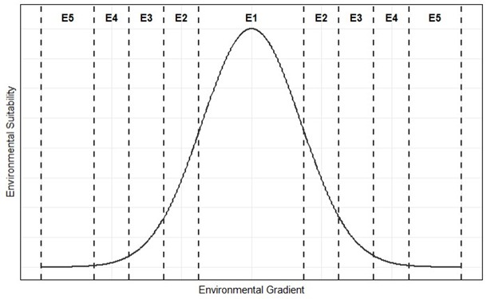

**Environmental Suitability Ratings**

CCISS incorporates historical (1961-1990) tree species environmental
suitability ratings for all site series in British Columbia as
determined by expert knowledge as data inputs. The primary criterion of
this historical rating is an assessment of the probability of successful
establishment and growth of a species across the entire environmental
space of a site series, in the baseline (pre-climate change) climate
normal period of 1961-90. These environmental suitability ratings
conceptually represent a response curve of the species’ tolerances to
environmental (climatic and edaphic) gradients (Fig 1). Site-level
variation in species suitability within each biogeoclimatic unit for
Alberta and the USA was similarly approximated using the plot data
located in the modelled climate areas. More information is available in
Archibald et al. (1996) and MacKenzie & Mahony (2021), describing forest 
associations or ecosites, and available autecological interpretations.

Figure 1: Conceptual model of Environmental Suitability Ratings as a response to environmental gradients.

**Suitability Definitions**

We define environmental suitability using five categories:

**E1 -- High environmental suitability**: Species well within its
environmental tolerance range.

-   Widespread establishment/regeneration success on all climate and
    edaphic conditions representative of the site series. Expect
    continuous distribution at a landscape or stand level.

-   Good growth rate and form across the full range of site conditions.

-   Typically, no geographic or environmental limitations within the
    site series.

-   The species is generally common and abundant in natural forests but
    may be of variable abundance where disturbance regime/stand age
    distribution is unfavorable (e.g., shade intolerant species in low
    disturbance landscapes).

**E2 -- Moderate environmental suitability**: Species occurring outside
its core environmental tolerance range.

-   The species has variable abundance in natural forests and/or is
    often concentrated in select site types of the site series (e.g.,
    warm aspects, higher elevations, elevated micro sites). Patchy or
    zoned distribution at a landscape and/or stand level are common.

-   Not all site conditions of the site series may be suitable for
    successful establishment/regeneration. Species success is reduced
    when established in the open and species is fully exposed to climate
    conditions (e.g., Cw establishment in open conditions in drier ICH
    climate is limited by heat and sun exposure).

-   Species may be more susceptible to occasional but expected climatic
    extremes leading to reduced growth, possible damaged form, or
    mortality (e.g. drought periods, snowpress, extreme temperatures,
    flooding).

-   The species may have good growth and survival where successfully
    established on suitable landscape positions or microsites. However,
    E2 rating may be used to reflect site series with broadly unsuitable
    site conditions across species (e.g., frost prone locations, or
    overly wet Spruce-horsetail site series).

-   May express slow growth rates or poor form across all site series
    conditions (e.g., site series within woodland subzones or xeric
    sites).

-   Geographic, topographic, or other environmental limitations are
    common.

**E3 -- Low environmental suitability**: Species occurring near the
limits of its climatic or site tolerance.

-   Species is likely to be adjacent to climates or site conditions that
    do not support its growth and survival. The species is generally
    infrequent in natural forests and/or has significant environmental
    limitations in the site series.

-   Only specific landscape positions or microsites in a site series are
    likely to have establishment/regeneration success, but subsequent
    good growth is possible when these conditions are met.

-   The species may require canopy cover for establishment and growth.
    Sites that are fully exposed and open to ambient climate are
    unsuitable.

-   E3 can be applied in BGCs with very limited growth potential (e.g.,
    site series in parkland subzones) or that have harsh site conditions
    for trees (e.g., very xeric sites with shallow, discontinuous soils).

-   Climatic extremes have a higher probability of causing reduced
    growth, damage, or mortality (e.g., drought periods, snow damage, and
    extreme temperatures).

-   Species express very low growth rates across all conditions (e.g.,
    site series in parkland subzones or treed rock outcrops).

-   Multiple limiting environmental factors are common. Limited
    viability of the site series for forestry may support an E3 rating
    for all species in that site series.

**E4 -- Minimal environmental suitability**: Species at the very limit
of its climatic or site tolerance. (*NOT CURRENTLY INCORPORATED INTO
CCISS PROJECTIONS*)

-   Species may occur sporadically but typically not forming any
    component of the forest canopy.

-   Scattered occurrence of individuals in natural stands but not
    reaching main canopy (e.g., Hw in the western SBSmc2).

-   Species may have persistent cover but low survival and poor growth.

-   Species assigned an E4 rating are not commercially viable due to
    poor survival and growth.

**E5 -- Not Suitable**: Species is outside of its environmental
tolerance range.

-   Environmental constraints preclude successful establishment, and
    species is not present in natural forests.

    -   E5 has been manually assigned only if the species was previously
        ranked as suitable for a site series in the CFRG and is
        reassessed as unsuitable. E5 rating is assumed where a species
        has no rating (i.e., is absent) for a given site series in the
        suitability tables.

More information on the development of the expert Environmental
Suitability ratings and the complete dataset of historic suitability
ratings for BC and Western North America can be found on the BC Data
Catalogue
[BCDC](https://catalogue.data.gov.bc.ca/dataset/1810fdca-8762-4d6a-8886-4e8cefbdb640)

**Suitability for different time periods**

Given the progression of climate change, the above suitability
definitions are incorporated into suitability rating assessments that
account for different time periods in the CCISS tool:

**Historic Suitability**: The baseline environmental suitability rating
based primarily on the expert suitability ratings of the historic period
(19961-1990).

**Establishment Suitability**: The suitability rating based on the mean
historic, current (2001-2020), and 2021-2040 future projected
suitabilities. This indicates the likely level of constraints for
successful establishment of the species now.

**Maturation Suitability**: The mean suitability rating projected across
the four 20-year normal periods (2021-2100). This indicates the inferred
suitability of successfully growing an established species to maturity
(80 years).

For additional information, see Instructions\> Suitability Report &
Methods \>Rule Sets.

**OHR Suitability**: Out of home range species -\> Off-site trials may
indicate that a non-local species was suitable in the pre-climate change
period but that migration lag or some other barrier restricted
establishment. For further information see Methods \> Outside Home
Range.

### Differences from the Chief Forester's Reference Guide

The [Establishment to Free Growing
Guidebooks](https://www2.gov.bc.ca/gov/content/industry/forestry/managing-our-forest-resources/silviculture/stocking-standards)
and [Chief Forester's Reference Guide for Stocking
Standards](https://www2.gov.bc.ca/assets/gov/farming-natural-resources-and-industry/forestry/silviculture/stocking-standards/reference-guide/reference_guide_stocking_standards_20210907.xlsx)
(CFRG) rank ecologically acceptable species for each site series. Three
criteria are used to determine the most suitable species choices for
sawlog production (the assumed management goal) based on an assessment
of:

-   maximum sustainable productivity
-   crop reliability
-   silvicultural suitability

The rankings applied always have at least one "primary" species for each
site series indicating the best species choice to meet the timber
objective.

In contrast, the CCISS tool assesses the environmental suitability
rating to species, which focuses on how well the species is suited to
the climatic and site conditions of a site series regardless of
management objective. Each tree species has adapted to a specific range
of environmental conditions, and its growth and behaviour depend on the
ecosystem in which it grows. In an unfavourable environment, that
species growth potential will not be realized, and its susceptibility to
damaging agents will increase. Unlike the ratings applied in the CFRG,
site series with generally challenging growing conditions may have no
tree species assigned to the highest suitability rating.

**DISCLAIMER**: Insect and disease risks need to be considered in
reforestation, particularly in the context of climate change. These
factors are currently being assessed by Forest Health researchers but
are not directly incorporated into the historic ratings or CCISS
environmental suitability projections. For more information please see
"Using CCISS for Decisions" tab.

##### References: 
Archibald, J. H., G. D. Klappstein, and I. G. W. Corns. 1996. Field guide to ecosites of southwestern Alberta. Special Report 8. Natural Resources Canada, Canadian Forest Service, Northwest Region, Northern Forestry Centre, Edmonton, Alberta.

MacKenzie, W. H., and C. R. Mahony. 2021. An ecological approach to climate change-informed tree species selection for reforestation. Forest Ecology and Management 481:118705.
