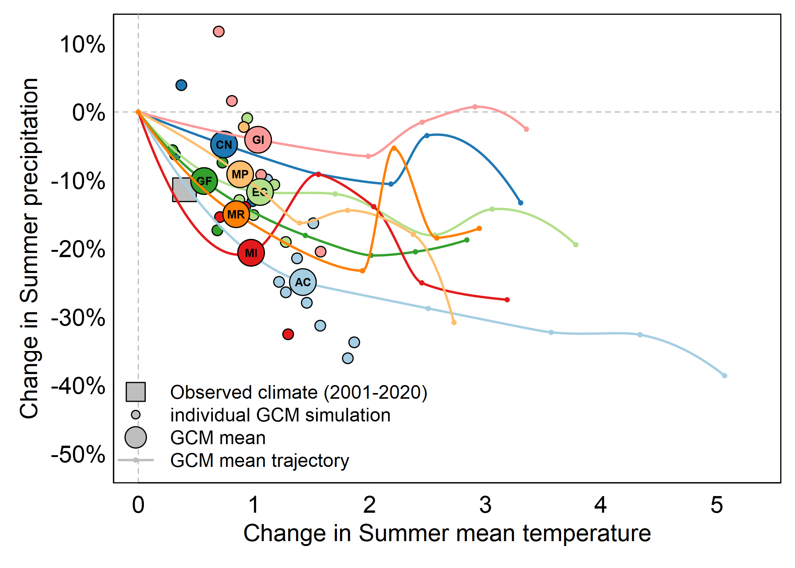
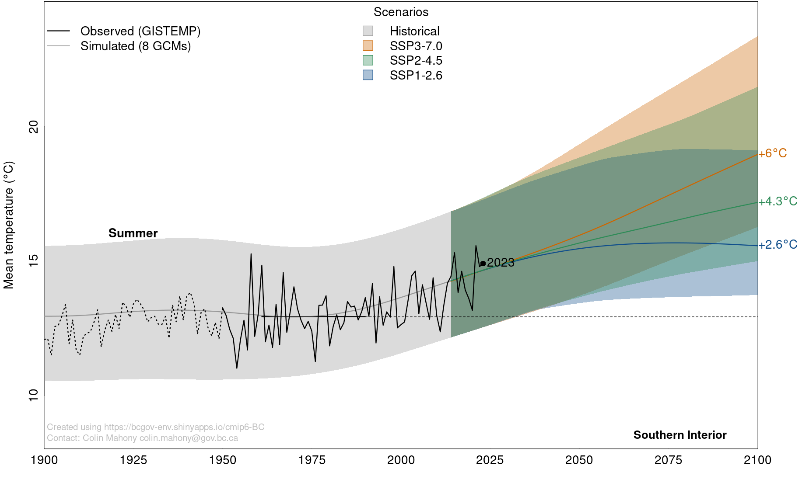

### Climate Change Projections

CCISS quantifies three types of climate change uncertainty: modeling uncertainty, natural variability, and socioeconomic uncertainty. These uncertainties are represented by calculating CCISS results for a large ensemble of potential future climate states. Rather than producing a single species suitability value, CCISS provides a distribution of 72 suitability values (8 climate models x 3 simulation runs x 3 socioeconomic scenarios) for each future time-period. 

#### Climate modeling uncertainty
 
Climate models are simplifications of the earth system; they involve many compromises in modeling complex processes. Consequently, an ensemble of independent climate models is required to represent modeling uncertainties about climate change outcomes over large regions. CCISS uses an ensemble of 8 global climate models (GCMs), selected by [Mahony et al. (2022)](https://rmets.onlinelibrary.wiley.com/doi/full/10.1002/joc.7566), for independent modeling methods that are consistent with historical climate changes and the IPCC assessed range of very likely climate sensitivity. This ensemble is described and visualized in the [cmip6-BC app](https://bcgov-env.shinyapps.io/cmip6-BC/). 

#### Natural variability

Global climate models, and the Earth system itself, have internal variability—weather at time scales of hours to decades. At any point in time, the climatic conditions in different GCMs can differ not only because of differences in how they model climate, but also due to internal variability (weather). Even 20-year averages can differ significantly in different runs of the same model (Figure 1). For this reason, we include three independent simulation runs of each climate model in the CCISS ensemble. 

Figure 1: Trajectories of simulated and observed climate change for southern Vancouver Island, illustrating uncertainty due to natural variability (weather) and structural differences among models. Small points are the changes in climate from 1961-1990 to 2001-2020 in up to ten independent simulations for each of eight global climate models (SSP2-4.5 scenario). Larger labelled points indicate the single-model ensemble mean change in 2001-2020. Lines indicate the trajectory of each single-model ensemble mean through 2100, with dots on each line indicating the ensemble mean during the five 20-year periods of the 21st century. The large grey square is the change in observed climate from 1961-1990 to 2001-2020 averaged across weather stations for the region. Trajectories further from the dotted grey lines (no change) indicate larger projected changes in summer precipitation (y-axis) and mean temperature (x-axis) or both. Model uncertainty is driven by differences in the global climate models (i.e. different colors) as well as differences in the individual runs of the same model (i.e. small circles of same color), 

#### Socioeconomic uncertainty

The third major category of climate change uncertainty relates to future concentrations of greenhouse gas concentrations in the atmosphere that result from global emissions policies and socioeconomic development. The climate model projections used by CCISS follow scenarios of future greenhouse gas concentrations commonly referred to as Shared Socioeconomic Pathways (SSPs). CCISS includes projections for three major SSP scenarios: SSP1-2.6, SSP2-4.5, and SSP3-7.0 (Figure 2). SSP1-2.6 assumes strong emissions reductions (mitigation) roughly consistent with the goal of the Paris Climate Accords to limit global warming to 2^o^C above pre-industrial temperatures. SSP2-4.5 assumes moderate mitigation and is roughly consistent with current emissions policies and economic trends. SSP3-7.0 is representative of a broader range of “baseline” scenarios that assume the absence of mitigation policies and is characterized by a linear increase in the rate of greenhouse gas emissions. Collectively, SSP1-2.6, SSP2-4.5, and SSP3-7.0 provide a reasonable representation of optimistic, neutral, and pessimistic outlooks (respectively) on global GHG emissions reduction efforts ([Hausfather and Peters 2020](https://www.nature.com/articles/d41586-020-00177-3)). 

Figure 2: Projected change in summer mean temperature for the Southern Interior Ecoprovince of BC, showing the ensemble mean and range of the 8-model climate ensemble for the three greenhouse gas concentration scenarios used as a default setting in the CCISS tool. 
