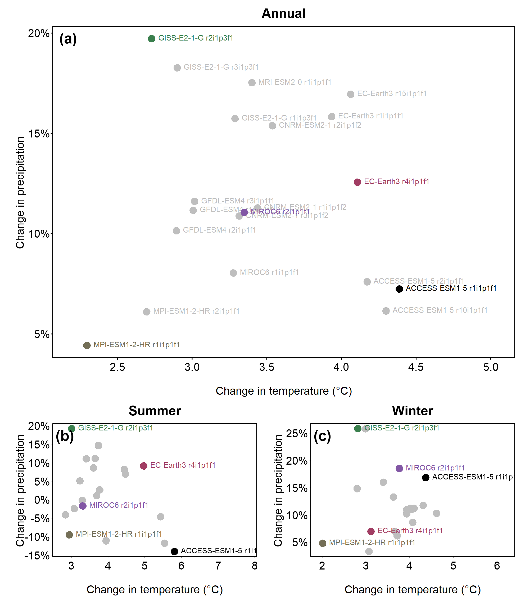
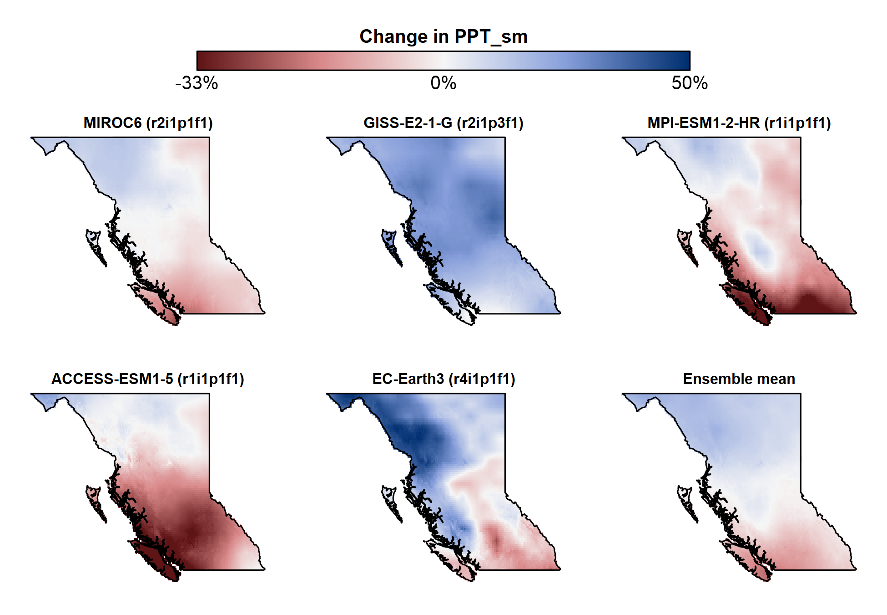
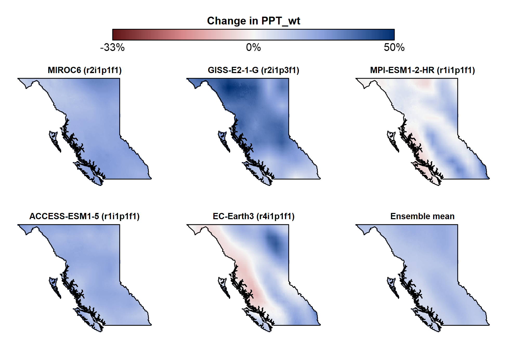

## Climate Change Projections

This section describes the rationale for the global climate model simulations used in CCISS and describes the small ensemble of five representative simulations used in the CCISS spatial module. 

### The CCISS climate model ensemble for representing climate change uncertainty

CCISS quantifies three types of climate change uncertainty: modeling uncertainty, natural variability, and socioeconomic uncertainty. These uncertainties are represented by calculating CCISS results for a large ensemble of potential future climate states. Rather than producing a single species feasibility value, CCISS provides a distribution of 60 feasibility values (8 climate models x 1-3 simulation runs x 3 socioeconomic scenarios) for each future time-period. 

#### Climate modeling uncertainty
 
Climate models are simplifications of the earth system; they involve many compromises in modeling complex processes. Consequently, an ensemble of independent climate models is required to represent modeling uncertainties about climate change outcomes over large regions. CCISS uses an ensemble of 8 global climate models (GCMs), selected by [Mahony et al. (2022)](https://rmets.onlinelibrary.wiley.com/doi/full/10.1002/joc.7566), for independent modeling methods that are consistent with historical climate changes and the IPCC assessed range of very likely climate sensitivity: ACCESS-ESM1.5, CNRM-ESM2-1, EC-Earth3, GFDL-ESM4, GISS-E2-1-G, MIROC6, MPI-ESM1.2-HR, and MRI-ESM2.0. This ensemble is described and visualized in the [cmip6-BC app](https://bcgov-env.shinyapps.io/cmip6-BC/). 

#### Natural variability

Global climate models, and the Earth system itself, have internal variability—weather at time scales of hours to decades. At any point in time, the climatic conditions in different GCMs can differ not only because of differences in how they model climate, but also due to internal variability (weather). Even 20-year averages can differ significantly in different runs of the same model (Figure 1). For this reason, we include three independent simulation runs of each climate model in the CCISS ensemble. 

<figure>
  
  <figcaption style="font-size: 0.9em; color: gray;">Figure 1: Trajectories of simulated and observed climate change for southern Vancouver Island, illustrating uncertainty due to natural variability (weather) and structural differences among models. Small points are the changes in climate from 1961-1990 to 2001-2020 in up to ten independent simulations for each of eight global climate models (SSP2-4.5 scenario). Larger labelled points indicate the single-model ensemble mean change in 2001-2020. Lines indicate the trajectory of each single-model ensemble mean through 2100, with dots on each line indicating the ensemble mean during the five 20-year periods of the 21st century. The large grey square is the change in observed climate from 1961-1990 to 2001-2020 averaged across weather stations for the region. Trajectories further from the dotted grey lines (no change) indicate larger projected changes in summer precipitation (y-axis) and mean temperature (x-axis) or both. Model uncertainty is driven by differences in the global climate models (i.e., different colors) as well as differences in the individual runs of the same model (i.e., small circles of the same colour). </figcaption>
</figure>

#### Socioeconomic uncertainty

The third major category of climate change uncertainty relates to future concentrations of greenhouse gases (GHGs) in the atmosphere that result from global emissions policies and socioeconomic development. The climate model projections used by CCISS follow scenarios of future greenhouse gas concentrations commonly referred to as Shared Socioeconomic Pathways (SSPs). CCISS includes projections for three major SSP scenarios: SSP1-2.6, SSP2-4.5, and SSP3-7.0 (Figure 2). SSP1-2.6 assumes strong emissions reductions (mitigation) roughly consistent with the goal of the Paris Climate Accords to limit global warming to 2^o^C above pre-industrial temperatures. SSP2-4.5 assumes moderate mitigation and is roughly consistent with current emissions policies and economic trends. SSP3-7.0 is representative of a broader range of “baseline” scenarios that assume the absence of mitigation policies and is characterized by a linear increase in the rate of greenhouse gas emissions. Collectively, SSP1-2.6, SSP2-4.5, and SSP3-7.0 provide a reasonable representation of optimistic, neutral, and pessimistic outlooks (respectively) on global GHG emissions reduction efforts ([Hausfather and Peters 2020](https://www.nature.com/articles/d41586-020-00177-3)). 

<figure>
  
  <figcaption style="font-size: 0.9em; color: gray;">Figure 2: Projected change in summer mean temperature for the Southern Interior Ecoprovince of BC, showing the ensemble mean and range of the 8-model climate ensemble for the three greenhouse gas concentration scenarios used as a default setting in the CCISS tool.  </figcaption>
</figure>

### The CCISS Small Ensemble of GCM runs

In the CCISS spatial module we provide biogeoclimatic projections for five GCM simulations that represent the diversity of patterns and trends in climate change across the full CCISS ensemble of 60 GCM simulations. This small ensemble of representative simulations was selected using the KKZ algorithm ([Cannon 2015](https://journals.ametsoc.org/view/journals/clim/28/3/jcli-d-14-00636.1.xml)), which selects the model simulations that span as large of a range of climate changes as possible. We implemented this method using the mean of the changes in the biogeoclimatic model predictor variables from the 1961-1990 reference period to the 2081-2100 time period under the SSP2-4.5 scenario. 

The five simulations provide a reasonable representation of the ensemble variation in temperature and precipitation changes (Figure 3). These simulations are not consistent in their position with respect to the rest of the ensemble; for example, the EC-Earth3 simulation has more warming than the ensemble mean in summer (Figure 3b) but less warming in winter (Figure 3c). Further, there is substantial spatial variation in precipitation change that can be obscured by the BC average (Figures 4 and 5). For example, the MPI-ESM1 simulation has very strong reductions in summer precipitation in southern BC that are balanced by increases in summer precipitation in Northern BC (Figure 4). For these reasons, it is not possible to characterize the simulations in simple contrasting extremes such as cooler/wetter vs. hotter/drier. Nevertheless, the five members of the small ensemble can be generically characterized as follows: 

- MIROC6 r2---representative of the centroid (average) of the ensemble. 
- MPI-ESM1-2-HR r1---least warming with regionally variable precipitation change (e.g., Figure 4).
- GISS-E2-1-G r2---low warming with large precipitation increase.
- EC-Earth3 r4---high warming with regionally variable precipitation change.
- ACCESS-ESM1-5 r1---highest warming with strong summer drying in southern interior BC.

<figure>
  
  <figcaption style="font-size: 0.9em; color: gray;">Figure 3: Change in annual and seasonal temperature and precipitation of the small ensemble of GCM runs, relative to the full CCISS ensemble. Changes are from the 1961-1990 reference period to 2081-2100 under the SSP2-4.5 scenario, and are averaged across British Columbia. (a) Change in mean annual temperature vs. annual precipitation. (b) Change in Summer mean daily maximum temperature vs. summer precipitation. (c) Change in winter mean daily minimum temperature vs. winter precipitation. Simulation names (e.g., r2i1p3f1) indicate the **r**ealization (run), **i**nitialization, **p**hysics scheme, and **f**orcing scheme. </figcaption>
</figure>

<figure>
  
  <figcaption style="font-size: 0.9em; color: gray;">Figure 4: Spatial pattern of changes in summer precipitation in the small ensemble of GCM runs, and of the full ensemble mean. Changes are from the 1961-1990 reference period to 2081-2100 under the SSP2-4.5 scenario. </figcaption>
</figure>

<figure>
  
  <figcaption style="font-size: 0.9em; color: gray;">Figure 5: Spatial pattern of changes in Winter precipitation in the small ensemble of GCM runs, and of the full ensemble mean. Changes are from the 1961-1990 reference period to 2081-2100 under the SSP2-4.5 scenario. </figcaption>
</figure>

### References

Cannon, A. J. 2015. Selecting GCM scenarios that span the range of changes in a multimodel ensemble: Application to CMIP5 climate extremes indices. Journal of Climate 28:1260–1267.

Hausfather, Z., and G. P. Peters. 2020. Emissions - the “business as usual” story is misleading. Nature 577:618–620. 

Mahony, C.R., T. Wang, A. Hamann, and A.J. Cannon. 2022. A global climate model ensemble for downscaled monthly climate normals over North America. International Journal of Climatology. 42:5871-5891. doi.org/10.1002/joc.7566
