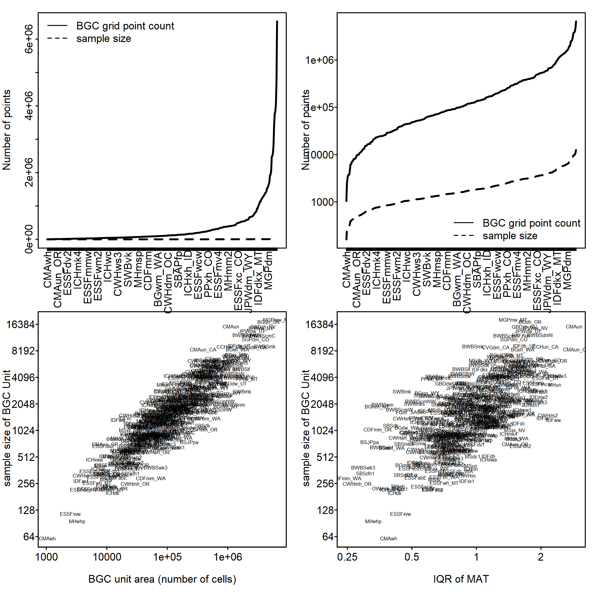
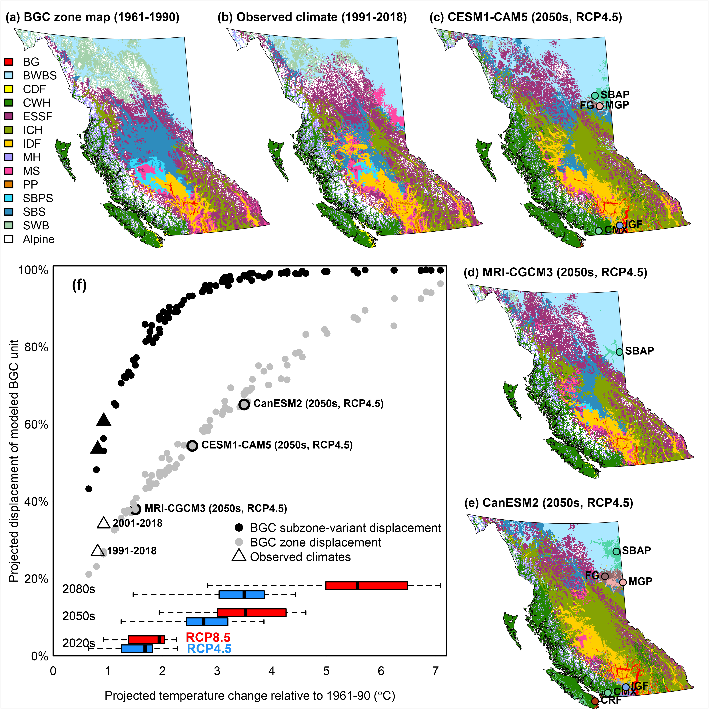

### Biogeoclimatic modeling

CCISS uses spatial climatic analogs to make inferences about future tree
species feasibility. A spatial climate analog is a location with a
historical climate that is similar to the current or future projected
climate of a different location. Biogeoclimatic subzone/variants are a
uniquely useful set of spatial climate analogs because they are familiar
to resource management practitioners and are the organizing units for
site-specific ecological interpretations accumulated over many decades.

In the CCISS framework, biogeoclimatic analogs are identified by
training a statistical or machine learning model to recognize
biogeoclimatic subzone-variants in terms of their historical (1961-1990)
climatic conditions, and then applying that classification model to new
(current or projected) climate conditions. The new climates are thus
labelled using their best analog within the BEC system, a process called
biogeoclimatic projections.

#### The CCISS BGC model

##### Training point sampling scheme

To balance trade-offs between oversampling large BGC units and
undersampling small BGC units, CCISS assigns training points to BGC
units proportionally to the square root of the area of each BGC unit.
This method ensures that smaller BGC units receive a relatively larger
proportion of points compared to their total size, which prevents overly
small units from being underrepresented in predictions. The number of
points per BGC unit is then scaled by the interquartile range (IQR) of
mean annual temperature (MAT), which results in BGC units with greater
spatial climatic variation receiving more training points (Figure 1).

Figure 1: Diagnostic plots for the chosen sampling scheme. Top panels
show the number of possible points (i.e., pixels) by BGC
subzone/variant, organized by smallest to largest BGC unit area on
linear (top left) and logarithmic scale (top right), represented by the
solid black line. The dashed line represents the number of training
points (i.e., sample size). HVC labels on the axis are a subset of the
300+ BGC units represented in the plot. Bottom panels show sample size
selected by each BGC unit area (bottom left) and based on the IQR of MAT
(bottom right).

##### Climate variable set

At the provincial scale, many variables effectively distinguish between
coastal and interior climates, which is useful for broad-scale
differentiation. However, these same variables can be less effective in
distinguishing nearby BGC units from one another. Thus, to ensure that
the retained variables were relevant for both local and regional
differentiation, expert knowledge was combined with a local feature
selection approach. Specifically, a set of ecologically relevant
seasonal and annual climate variables was pre-selected, in addition to
several derived variables. Any highly correlated variables were removed
at this stage. A list was created, where each BGC unit was paired with
all neighbouring BGC units. Separate random forest models were run, each
with 101 trees, to determine the most important climate variables for
each BGC unit, considering only that BGC unit and its neighbouring BGC
units. These RF models used the “Gini” split rule, and variable
importance was calculated based on Gini impurity. Once a list of
variable importance was created for each BGC unit, the most important
variables were retained. Care was taken to include even those that may
have only been important for a few select BGC units to retain the
ability to differentiate between BGC units at a local scale.

In summary, the final expert variable set was chosen based on ecological
relevance, low correlation, and high predictive importance within each
BGC unit.

##### Random forest model details

To classify BGC units, a random forest (RF) machine learning model was
trained using the ‘ranger’ package in R (Wright and Ziegler 2017). This
model was built using 500 decision trees, the extraTrees split rule, and
a minimum node size of two, with training points selected according to
the sampling scheme and climate variable set outlined above. This model
underwent validation and comparison against alternative approaches,
including multiple sensitivity analyses to assess robustness, accuracy,
and sensitivity to training selection schemes and various model
hyperparameters. For more information, see: LINK

#### Overview of BGC projection trends

Biogeoclimatic projections are illustrated in Figure 2, excerpted from
Mackenzie & Mahony (2021). While there is considerable variability in
the pace and character of biogeoclimatic projections driven by different
climate models, there are some common zone-level trends: the expansion
of the IDF analogs northward into the current SBPS zone and into higher
elevations in the current MS zone; the expansion of ICH analogs
northward into the current SBS zone and into higher elevations in the
current ESSF zone; the expansion of CWH analogs into higher elevations
in the current MH zone and eastward into the current SBS zone; and the
displacement of the current SWB zone by the ESSF analogs. Inter-model
differences in precipitation changes are reflected in the biogeoclimatic
projections, such as in the expansion of ICH analogs into the central
interior in the wetter CanESM2 model instead of IDF analogs in the drier
CESM1-CAM5 model. However, the tight relationship between warming and
climatic displacement (Figure 1f) suggests that inter-model differences
in the rate of displacement of historical climates are primarily driven
by the amount and regional pattern of warming.

The biogeoclimatic projections for the 2011-2040 period include the
incursion of exotic biogeoclimatic zone analogs into the province; e.g.,
the Sub-Boreal Aspen Parkland (SBAP) zone from Southeastern Alberta and
the Interior Grand Fir (IGF) zone from Northwestern Oregon. In addition
to these exotic biogeoclimatic zones, analogs for the projected future
climates of BC also include exotic subzone/variants of familiar zones.
The largest area of projected exotic subzone/variant analogs is in the
boreal northeast of the province, where Albertan subzone/variants of the
BWBS zone dominate. In later periods (2050s and 2080s), exotic analogs
are also projected in the major valley systems of southern BC and on the
south coast.

Figure 2: An example of biogeoclimatic projections for British Columbia,
excerpted from Mackenzie & Mahony (2021). (a) Mapped biogeoclimatic
zones, which encompass the 211 biogeoclimatic subzone/variants used to
model tree species feasibility. (b) Biogeoclimatic projection of the
recent period (1991-2018). (c-e) Biogeoclimatic projections of the
2041-2070 period (RCP4.5) for two GCMs with medium (CESM1-CAM5), low
(MRI-CGCM3) and high (CanESM2) regional climate sensitivity. (f)
Biogeoclimatic displacement relative to the change in the BC-mean
temperature change for each of 90 model projections. Biogeoclimatic
displacement is the proportion of grid cells across BC that have a
different projected biogeoclimatic unit than their model-predicted
biogeoclimatic unit of the 1961-1990 reference period. Boxplots show the
full range and 25th-75th percentile range of the temperature change
projected by the 15-GCM ensemble in each RCP/time period combination.

#### Known issues

This version of the BGC projections is a work in progress, and future
refinements will be made. As more end users engage with the CCISS tool,
additional issues may come to light. Users can report any issues or
discrepancies here.

We have already identified several areas for improvement. One key issue
is that the baseline maps are not being perfectly reconstructed,
resulting in fuzzy boundaries, and the over- and underrepresentation of
certain BGC units. For example, the Coastal Mountain-heather Alpine
(CMA) zone in the Pemberton region appears to be consistently
underrepresented.

Additionally, future projections appear highly sensitive to changes in
sampling scheme (Appendix A4), climate variable sets, and RF model
hyperparameters. These factors will be closely examined in future
iterations to improve the model’s predictive ability.

#### Guidance for interpretation of biogeoclimatic projections

##### Evaluating BGC Future Projections
An important consideration when evaluating the quality of any BGC future
projection is that, ideally, it should be compared to the baseline of
the same model, rather than to the original BEC linework. In some cases,
the BEC linework and climate data informing the model might not align. A
mismatch between the model and linework does not necessarily indicate an
error. Discrepancies between BGC mapping and baseline BGC projections
can, in some cases, indicate errors in the BGC mapping, and in others,
errors in the baseline climate mapping, and should therefore be
interpreted carefully on case-by-case basis rather than assumed to be
inaccuracies.

##### Interpreting Spatial Shifts in BGC Projections 
Although the visual effect of biogeoclimatic projections is of BGC zones and
subzone/variants shifting across the map, these spatial shifts should
not be taken literally. No analog is perfect, and projected analogs may
be highly imperfect for several reasons. The actual future climate at
any location will be a hybrid of (1) the characteristics of the analog
climate, (2) novel climatic characteristics (e.g., extremes) that are
not represented by the analog, and (3) enduring features of the local
climate such as frost pooling, lake effects, and wind patterns. The
estimated BGC classifications from any location and time period require
careful consideration by the end users of CCISS products. The Role of

##### BGC Mapping in a Changing Climate 
The misinterpretation of biogeoclimatic projections as literal spatial shifts 
in BGC units has led to a common perception that climate change is rendering
biogeoclimatic mapping obsolete. This is not the case. The linework of
biogeoclimatic subzone/variants in many cases will remain useful as
units of relative climatic variation across landscapes. The terminology
we use for biogeoclimatic projections can help to emphasize that
biogeoclimatic analogs are only approximations and that the
biogeoclimatic units themselves are not undergoing spatial shifts.
Rather than saying “this location is becoming IDFxh1”, it is more
correct to say “the future climate at this location is predicted to be
similar to the historical climate of the IDFxh1.” Rather than “the IDF
is moving north into the SBS”, it is better to say “the SBS is
transitioning into more IDF-like climates”.
