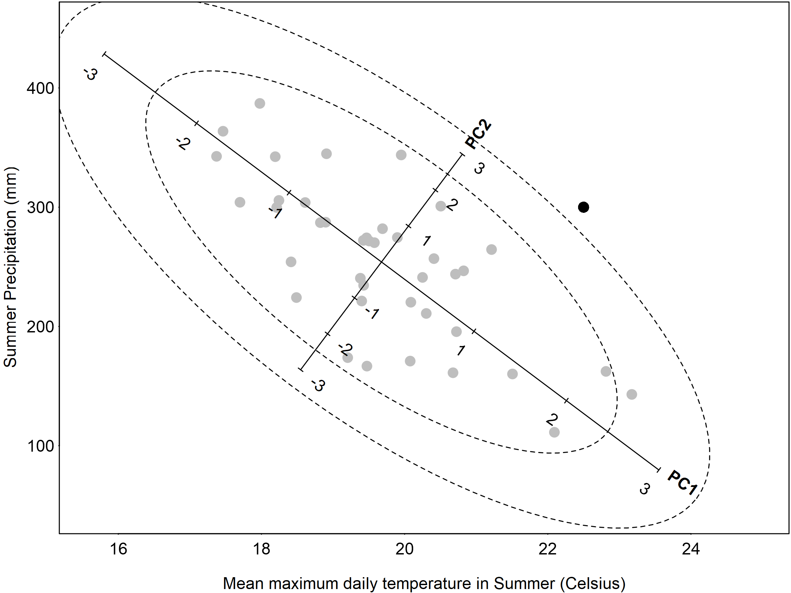

# Novel Climate Detection

In the CCISS framework the pool of historical climate analogs consists of biogeoclimatic subzone-variants from British Columbia, Alberta and the Western United States. For each projected future climate, the biogeoclimatic model chooses the most similar climate analog from this analog pool. However, the climates of western North America do not necessarily represent all potential future climate conditions. There may be substantial differences between the future climate condition and the climate conditions of the biogeoclimatic analog. In such cases, the future conditions are a novel climate. The basic problem of novel climates (poor analogs) is that they give misleading results but are not explicitly identified by the biogeoclimatic model. Detecting novel climates requires an additional step in the CCISS analysis. 

CCISS measures climatic novelty relative to the climatic variation of the analog. In each biogeoclimatic projection, we calculate a novelty measurement for each BGC subzone/variant that is being used as an analog. We sample the baseline  (1961-1990) climates found across the current geographical range of each BGC subzone/variant, and combine this spatial variation with the 1951-1990 temporal variation of the analog. This pooled spatiotemporal variation is then used to measure the difference between the climate of the analog and the future climates that are assigned that analog in the biogeoclimatic projection. To make this measurement, we use a metric called sigma dissimilarity (Mahony et al. 2017). 

Novelty detection for machine learning models is non-trivial and imprecise. The novelty metric provides an indication of where CCISS results may be unreliable or require additional expert input. However, it likely underestimates novelty in some locations and overestimates it in others. Users are encouraged to look at the broader pattern of novelty around their query locations to assess whether their local novelty results are representative. Over time, the CCISS team will develop region-specific interpretations of the drivers of climatic novelty and their ecological implications. 

This article describes the CCISS novelty detection methods and results in a coastal case study and at the provincial scale. The goal of this article is to provide users with the ability to interpret novelty results with an understanding of the strengths and limitations of the method. 

## Definitions

The following are definitions of key terms used in this article: 

-	**Baseline** --- The historical climate used to compare observed climates of more recent periods or simulated future climates. The CCISS baseline period is 1961-1990. 
-	**Target** --- The current or future climate condition for which a historical analog is identified, and for which novelty is being measured. In CCISS, these are climatic averages over 20-year periods (2001-2020 through 2081-2100) for locations throughout BC. 
-	**Analog** --- The baseline climate condition assessed as being most similar to the target condition, among a set of candidate analogs. The analog pool for CCISS is the 1961-1990 climates of the biogeoclimatic subzone-variants of Western North America. 

## The novelty metric – sigma dissimilarity

The basic question we are asking in novel climate detection is: “how similar is the future climate condition to the climatic conditions of the historical climate analog.” A statistical rephrasing of this question is: “what is the probability that the future climate condition was drawn from the same distribution as the climatic conditions of the historical analog?”  Mahalanobis distances are commonly used to answer this type of question. Following Mahony et al. 2017, we translate Mahalanobis distances into a novelty metric called sigma dissimilarity. 

### Mahalanobis distance

The typical understanding of distance is Euclidean distance, in which a line of equal distance from any point has the shape of a circle or sphere. The problem with Euclidean distance for novelty detection is that it doesn’t account for correlations among variables. If variables are correlated (as climate variables often are), the standardized Euclidean distance will overestimate the novelty of some points and underestimate the novelty of others. Mahalanobis overcomes this problem by accounting for correlations among variables (Figure 1). Instead of following concentric circles like Euclidian distances do, Mahalanobis distances follow ellipses with eccentricity that matches the correlation of the data. Assuming multivariate normality, Mahalanobis distances represent lines of equal probability that a new observation is an outlier. Mahalanobis distances are equivalent to standardized Euclidean distances in the principal components of the variables. 

<figure>
  
  <figcaption style="font-size: 0.8em; color: gray;">Figure 1: Illustration of novelty/outlier detection using Mahalanobis distance. Grey dots are individual years of 1951-1990 summer temperature and precipitation at Quesnel, BC. The climate variables are correlated such that there is a dominant mode of variability—cool/wet years vs. warm/dry years—that is detected by a principal components analysis (PCA) as PC1. The more unusual mode of variability (cool/dry vs. warm/wet years) is the second principal component, PC2. Mahalanobis distance is equivalent to Euclidean distance measured in the standardized principal components. The dashed ellipses are the Mahalanobis distances within which 95% and 99.7% of the years would be expected to occur, assuming multivariate normality of the data. A hypothetical new climate observation (black dot) is within the individual (univariate) distributions of historical temperature and precipitation, but it can be identified as an outlier (i.e., a novel climatic condition) because it falls outside their bivariate distribution as described by Mahalanobis distance.  </figcaption>
</figure>

### Sigma dissimilarity

Mahalanobis distance is not in itself an adequate metric of novelty because the statistical meaning of distances depends on the number of dimensions in which the distances are measured. Since CCISS uses different numbers of principal components for different BGC analogs, these dimensionality effects are important. Thus to obtain an intuitive and statistically consistent novelty metric that can be used to compare across analogs, we use sigma dissimilarity (Mahony et al. 2017). 

#### Theory of sigma dissimilarity
The effect of dimensionality on the probabilities of distances can be visualized using a random sample from a multivariate normal distribution (Figure 2a).  In any one dimension (either the x or y axis), there is a 68% probability that an observation will be within one standard deviation of the mean. In other words, 68% of the points are expected to have a distance from the mean of less than one. In two dimensions, the probability that an observation will fall within a distance of one from the centroid is reduced to 39%. As the number of dimensions increases, even more observations fall outside a distance of 1, such that all observations become increasingly distant from their own mean. 

The probability of multivariate normal distances (and therefore Mahalanobis distances) are described by the chi distribution with degrees of freedom equaling the dimensionality of the data (Figure 2b-c). Chi percentiles can be expressed using the terminology of univariate z-scores; i.e., 1, 2, and 3 sigma (σ) for the 68th, 95th, and 99.7th normal percentiles, respectively. The chi distribution in 1 dimension is a half-normal distribution, and the sigma levels correspond to distance. This result is expected because Mahalanobis distances in one dimension are the absolute values of z-scores.  At increasing dimensionality, the sigma levels shift away from the origin.  For example, 1σ (the 68th percentile) occurs at Mahalanobis distances of 1.0 in one dimension versus 1.5 in two dimensions (Fig 2b, c).  By extending sigma levels into multiple dimensions, sigma dissimilarity serves as a multivariate z-score. 

<figure>
  
  <figcaption style="font-size: 0.8em; color: gray;">Figure 2. An illustration of the basis for sigma dissimilarity. a, Geometric illustration of the effect of dimensionality on the probability density of distances. b-c, Use of the chi distribution to describe Mahalanobis distances as sigma (σ) percentiles at increasing dimensionality.  </figcaption>
</figure>

## Novel climate detection in CCISS

To measure climatic novelty with sigma dissimilarity, we need to define the variation that the Mahalanobis distance is proportioned to. The question we are asking is “novel relative to what?” 

Since CCISS uses biogeoclimatic (BGC) subzone-variants as climate analogs, it is primarily interested in whether the target (future) climate matches the baseline (historical) climate of any location within the analog. In other words, CCISS is most interested in measuring novelty relative to the spatial climatic variation of the analog. However, we have also found it necessary to include the interannual climatic variability (ICV) of the analog into the measurement (see rationale below). Therefore, we measure novelty relative to the spatiotemporal climatic variation of the analog. This is different from the approach of Mahony et al. (2017), who defined novelty relative to the interannual climatic variability of the target climate. 

Novel climates detection in CCISS is done separately for each BGC analog, in three steps: 

1.	Principal components analysis (PCA) – conduct a PCA on an equal sample of spatial variation in baseline and target climates of the analog, and choose a subset of the PCs that represent 95% of the variance in this pooled sample; 
2.	z-standardization – standardize the retained PCs so that the pooled analog spatial climatic variation and ICV have a mean of 0 and a standard deviation of 1; and 
3.	Measure sigma dissimilarity of target (future) climatic conditions. This approach measures dissimilarity from the target climate to the average climate of the BGC analog rather than to the most similar (potentially peripheral) location within the analog. 

### Rationale

#### In step 1, why is the PCA done on a combination of the baseline and target climates? 

Mahalanobis distance can be unstable if all PCs are included. For this reason, we retain only 3-6 PCs that describe 95% of the variance in the data. however, there is no guarantee that the major principal components of the analog’s spatial climatic variation include the ways in which the future climate is different than the analog climate. In other words, distance measurement in the primary modes of spatial variation could be blind to the primary modes of climate change. This would cause underestimation of novelty. To ensure that the differences between the future climates and the analog climate are detected, we conduct the PCA on a combination of spatial variation in both the analog and target climates . 

#### In step 2, why are the PCs standardized to both spatial and temporal variation of the analog? 

Scaling the novelty metric to spatial variation alone has two important shortcomings. First, very small BGC subzone/variants often have much less climatic variation relative to larger ones simply due to their size. This can lead to overestimation of climatic novelty for small subzone/variants. Second, spatial variation can be very low in the modes of climate change, especially for analogs that are located on flat terrain. Measuring climatic distances in PCs standardized to very low spatial variation can result in artificially high sigma dissimilarity. To make the novelty metric more robust, we include interannual climatic variability (ICV) in the z-standardization. Specifically, we pool the analog's spatial climatic variation with the climate values of each year in the 1951 -1990 period. A 40-year sample is used because it is more robust than 30 years. The ecological rationale for including ICV is that a future condition can be considered less novel if it is similar to individual years in the baseline climate instead of being entirely unprecedented. The effect of this modification is to reduce novelty in small and/or topographically simple BGC analogs.  

### Variable selection

Novelty should be measured in climate variables that are ecologically meaningful and relevant to the variables that were used to identify the climate analog. Superficially, it seems logical to measure novelty using the variables that were used to train the biogeoclimatic model. However, there are two reasons why the input variables to the BGC model are not necessarily the most appropriate for novelty measurement. 

1.	Machine learning doesn’t use input variables equally for differentiating each potential analog from its neighbours. For example, the variable selection and thresholds used to differentiate grassland from forest climates are likely to be different from those used to differentiate subalpine from alpine climates. Mahalanobis distance, in contrast, is blind to the variables that differentiate the focal analog from its neighbours and instead emphasizes the modes of spatial and temporal variation of the analog itself. As a result, even if both the BGC model and the novelty detection were given the same input variables, their results would not necessarily be any more consistent than a novelty detection with different input variables. 
2.	Mahalanobis distance relies on the assumption of multivariate normality, i.e., that the analog variation can be approximated with a hyperellipse. While this assumption generally holds for temperature and log-transformed precipitation variables, it can be severely violated by the bioclimatic variables often used in biogeoclimatic modeling, such as degree-days and climatic moisture deficit. Violations of the multivariate normality assumption can cause large novelty artefacts. 

For those reasons, CCISS novelty detection uses a basic 12-variable set of Tmin, Tmax, and precipitation of the four seasons. 

### Threshold selection

Novelty is a continuum. Further, the novelty measurement is prone to error because the relevant climates variables and ecological responses are unknown and specific to each ecosystem and tree species. Hence there is no objective basis for a threshold of sigma dissimilarity above which a target climate can be labelled as a novel climate. Nevertheless, it is necessary to establish a threshold of novelty above which BGC analogs will not be used to make inferences of future species suitability. If this threshold is set too high, CCISS will make invalid and misleading inferences. If the threshold is too low, useful information may be discarded. 

The CCISS tool uses a default dissimilarity threshold of 5-sigma (5$\sigma$) to infer a novel climate and discard the biogeoclimatic analog. 5$\sigma$ is a low bar to meet for analog goodness of fit. Assuming multivariate normality, it corresponds to a 1-in-3,500,000 chance that the target climate would occur within the analog’s geographical range and/or interannual climatic variability. However, given the many potential sources of error in the CCISS novelty measurement, 5$\sigma$ novelty could be more likely in some cases. This threshold provides a reasonable balance between the risks of making an invalid inference vs. discarding useful information. 

The CCISS tool also indicates the proportion of each species suitability projection that is in the 3-5$\sigma$ range. 3$\sigma$ corresponds to a 1-in-370 event within the analogs spatiotemporal climatic variability.  Novelty in the 3-5$\sigma$ range can be interpreted as a poor analog. In this range, species suitability inferences may be useful but are also likely to be somewhat misleading. 

## Case study – CWHxm_WA

To illustrate the interpretation of climatic novelty in biogeoclimatic projections, we use the example of the CWHxm_WA subzone (Coastal Western Hemlock very dry maritime, Washington variant), which spans the Puget Lowlands in Washington State from the hilltops of the San Juan Islands to Portland, Oregon (Figure 3). The baseline 1961-1990 climate of the CWHxm_WA is widely used as an analog for current and future climates of the near-shore lands surrounding the Strait of Georgia including Greater Vancouver. 

<figure>
  
  <figcaption style="font-size: 0.8em; color: gray;">Figure 3: Location of the CWHxm_WA subzone in the Puget lowlands of Washington State. The CWHxm_WA is a common analog for novel near-future climates of the Georgia Basin, including Vancouver, BC. Areas of BC are mapped by degree of novelty for an EC-Earth3 SSP2-4.5 simulation for the 2041-2060 period. This image is a screenshot from the CCISS spatial module.  </figcaption>
</figure>

The variation of the baseline analog climates and the target climates are quantified in a PCA scree plot (Figure 4). The basic interpretation of the scree plot is that there are 12 PCs because there are 12 input variables each standardized to unit variance (st. dev. = 1).  Since the PC was performed on the combined target and analog climates , PC1 is the primary mode of separation between the target and analog climates. PC2 contains the most spatial variation in the analog and target climates but very little separation of their means, as visualized in Figure 5b. Subsequent PCs contain decreasing spatial variation of analog and target climates, such that 95% of the variance in the pooled data is contained within the first four PCs. This was the criterion for exclusion of PCs 5-12. ICV variation does not decline as quickly because it was excluded from the PCA.  

<figure>
  
  <figcaption style="font-size: 0.8em; color: gray;">Figure 4: Scree plot of the principal components analysis used in novelty detection for future climates (EC-Earth3, 2041-2060, SSP2-4.5) assigned to the CWHxm_WA analog. Circles represent the climatic variation in each PC of the analog climates (baseline climates of the CWHxm_WA), target climates (future climates assigned to the CWHxm_WA analog), and ICV (1951-1990 interannual climatic variability of the CWHxm_WA). Black triangles are the distance between the means of the target and analog climates. 4 PCs are retained for novelty detection based on the criterion of retaining 95% percent of the pooled target and analog variance.   </figcaption>
</figure>

When viewed in the climate space of the first two PCs (Figure 5a), there is a clear separation in the baseline (1961-1990) climates of the CWHxm_WA (analog climates, blue dots) and the target (2041-2060) climatic conditions that are classified by the model as CWHxm_WA (red, orange, yellow dots). Degrees of novelty in the target climates range from 4σ (yellow)---suggesting that the analog is a poor match for the target climate---to 7σ (dark red)---suggesting that the analog is non-valid for these highly novel climates.  The small overlap between the analog and target climates is an illusion of the 2-dimensional space of PC1 and PC2: When viewed in PC3 and PC4 (Figure 5c), the yellow target climates are non-overlapping with the analog climates, demonstrating that the 4th PC was required to detect the novelty in these climates. Since PC5 was excluded from the novelty measurement, the additional modes of novelty are not detected (Figure 5d). 
<figure>
  
  <figcaption style="font-size: 0.8em; color: gray;">Figure 5: Demonstration of novelty of future climates classified as the CWHxm_WA analog. Blue dots are the spatial variation in baseline (1961-1990) climates of the CWHxm_WA subzone. Black dots are the 1951-1990 interannual variability at a representative location  in the CWHxm_WA. Filled circles are projected 2041-2060 climates of locations in British Columbia that are assigned the CWHxm_WA analog by the BGC model, with colors indicating sigma novelty  consistent with the Figure 4 legend. Each panel provides a different orthogonal (perpendicular) view on the multidimensional data cloud, with PC1 being the axis with the most variation in the pooled points, and PC5 having the least.  </figcaption>
</figure>

The  climatic novelty of the CWHxm_WA target climates can be further visualized in the context of the baseline climates of Western North America (Figure 6). These projected 2041-2060 climates (yellow to red points) have no overlap with the spatial climatic variation of Western North America. The CWHxm_WA (blue points) is the best (i.e., most similar) available analog for these future climatic conditions, but it is a poor analog at best (yellow points) and a non-analog at worst (black points). The primary mode of novelty is positively correlated with mean summer nighttime temperature (Tmin_sm), but is also somewhat correlated with spring and autumn Tmin. Since the mode of novelty is relatively uncorrelated with precipitation and daily maximum temperatures , the CWHxm_WA may be an informative analog for ecological drivers, such as drought, that are primarily dependent on these variables. This illustrates how a climate analog can be useful for some interpretations, but misleading for others. 

<figure>
  
  <figcaption style="font-size: 0.8em; color: gray;">Figure 6: 3-dimensional view of the CWHxm_WA analog and target climate variation in context of other climates of Western North America. Symbology is consistent with Figure 5, with the addition of spatial variation (grey dots) and spatial means (multicolored dots) of the climates of other candidate BGC analogs. Labelled lines indicate correlations of the input variables with the 3 PCs that comprise the viewspace.   </figcaption>
</figure>

## Provincial-scale results

### Novelty over time

Figure 7 shows the progression of climatic novelty over time in a global climate model simulation of 21st century climate change. Even in the baseline period (1961-1990), scattered locations have some degree of novelty from their model-predicted biogeoclimatic unit (Figure 7a). This baseline novelty can be due to (1) spatial climatic variation within a BGC that violates the assumption of multivariate normality (isn’t elliptical in shape) and (2) baseline model predictions that differ from the BEC mapping. Overall, however, there is a very low degree of novelty in the baseline period, as would be expected. 

Novelty in the simulated 2001-2020 climate is also generally low (Figure 7b), with notable novelty inferred only in small areas of the Peace region foothills of Northeastern BC and the Tatshenshini-Alsek provincial park in northwestern BC. By midcentury (Figure 7c), there is widespread inference of moderate novelty (3-5σ; yellowish colours), indicating poor analogs in these areas. However, the majority of the province still has good analogs in this period (0-2σ; grey colours).  By the end of the century (Figure 7d), moderately to highly novel (>5σ) climates occupy most regions of the province. Highly novel climates are projected for Northeastern BC, the coast, the Chilcotin Plateau and southern interior. 

<figure>
  
  <figcaption style="font-size: 0.8em; color: gray;">Figure 7: Progression of climatic novelty over time. (a) Novelty of baseline observed climate. (b-d) Novelty of the EC-Earth3 simulation in three 20-year periods.   </figcaption>
</figure>

### Climate model variation 

There is considerable variation among global climate models in the magnitude of climatic novelty (Figure 8). Some of this variation is due to different warming rates in the models, as indicated by the similarity in spatial patterns of novelty among models. However, there is also variation among models in the level of novelty at each warming level (Figure 9). For example, the MIROC6 model induces approximately half of the novelty as the GISS model at warming levels above 2\u00B0C.   

<figure>
  
  <figcaption style="font-size: 0.8em; color: gray;">Figure 8: Variation in climatic novelty among individual simulations of global climate models, for the 2041-2060 period (SSP2-4.5 scenario).   </figcaption>
</figure>

<figure>
  
  <figcaption style="font-size: 0.8em; color: gray;">Figure 9: Relationship of BC-mean novelty to warming level. Each point is one of five 20-year periods, 3 simulations, and 3 SSPs for each model, for a total of ~45 points per model.  </figcaption>
</figure>

## Sensitivity Analysis

This section provides sensitivity analyses demonstrating the effect of key methodological decisions, namely variable selection, PC truncation rules, and how to balance spatial and temporal variation (ICV) in the standardization. Unless otherwise stated, sensitivity analyses use the EC-Earth3 r4i1p1f1 SSP2-4.5 simulation at the 2041-2061 time period. 

### Variable selection

The sensitivity of novelty to variable selection is illustrated in Figure 10. Both variable sets produce common regions of novelty, such as on the coast, southern Kootenays, and northeast BC, though the basic variables detect a lesser degree of novelty on the coast. The high-novelty region in the northern Columbia mountains in Figure 10b is likely an artefact of multivariate normality violation in degree-day and reference evaporation variables, which can have many zeros and highly skewed distributions. The disagreement between the two variable sets in the western Chilcotin is more enigmatic and deserves further investigation. 

<figure>
  
  <figcaption style="font-size: 0.8em; color: gray;">Figure 10: Sensitivity of climatic novelty to variable selection. Basic variables are Tmin, Tmax, and precipitation for the four seasons. BGC model variables are the 23 variables used to train the Random Forest model used to make the biogeoclimatic projections.  </figcaption>
</figure>

### Balance of spatial and temporal variation

Novelty is highly sensitive to the relative weight of spatial and temporal variation. When interannual climatic variability (ICV) is excluded from the novelty measurement (Figure 11a), novelty is extreme in areas of interior BC with low topographic relief. This is primarily due to the modes of climate change being different from the few modes of spatial climatic variation on flat terrain. Conversely, when spatial climatic variation is excluded (Figure 11d), novelty is greater on the coast. This is due to lower interannual climatic variability in maritime climates and the prevalence of spatially large biogeoclimatic subzone/variants in the coastal classification. The contrasting drivers of coastal and interior novelty balance each other at intermediate ICV weights  (Figure 11b-c). We chose an ICV weight of 0.5 for novelty detection in CCISS).  

<figure>
  
  <figcaption style="font-size: 0.8em; color: gray;">Figure 11: Sensitivity of climatic novelty to the balance of spatial vs. temporal (ICV) variation. ICV weight is the proportional influence of interannual climatic variability on the calculation of Mahalanobis distance, relative to spatial climatic variation.  </figcaption>
</figure>

### Dimensionality (PC truncation rule)

The CCISS novelty method retains PCs with a cumulative variance of 95% of the total data variance. Consequently, the dimensionality of the sigma dissimilarity differs among analogs, within the range of 4-6 PCs. Figure 12 illustrates the effect of dimensionality on novelty by measuring sigma dissimilarity at uniform number of PCs throughout BC. In general, novelty increases when more PCs are retained because there are more modes of variation for future conditions to be different from their analog. However, the CCISS novelty method is not highly sensitive to the dimensionality of the measurement (Figure 12). This indicates that the results of novelty detection do not hinge on the decision to the 95% variance criterion vs. other potential truncation rules.

<figure>
  
  <figcaption style="font-size: 0.8em; color: gray;">Figure 12: Sensitivity of climatic novelty to the number of principal components used to calculate Mahalanobis distance.  </figcaption>
</figure>

## References

Mahony, C.R., A.J. Cannon, T. Wang, and S.N. Aitken. 2017. A closer look at novel climates: new methods and insights at continental to landscape scales. Global Change Biology 23: 3934–3955.
