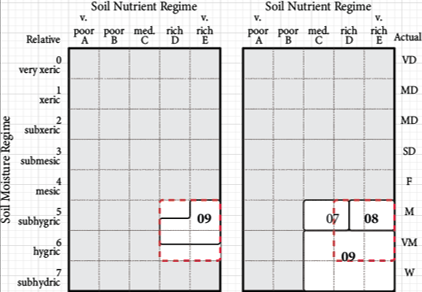

### Aligning Site Series (edatopic overlap)

#### The edatopic grid

In the BEC system, variations in site conditions within each climate type (i.e., biogeoclimatic subzone/variant) are represented by an edatopic grid. An edatopic grid has 8 relative soil moisture regimes (SMRs) and 5 soil nutrient regimes (SNRs). Each cell in this grid, called an edatope, is the combination of one SMR and one SNR, and represents the finest scale of site differentiation in the BEC system. A site series is a group of edatopes over which a classified BEC Plant Association has been observed to occur. The distribution of site series across the edatopic grid is unique to each biogeoclimatic subzone/variant.

#### Site series misalignment

In the CCISS analysis, the edatope of each location of interest remains constant as the climate changes. If species suitability ratings were specified for each edatope, and if the edatope of the location of interest were known, then there could be a direct transfer of species suitability from the future BGC analog to the location of interest. However, species suitability ratings are at the site series level, and typically the management decision is also being made at the site series level.  This creates a problem for the CCISS analysis: since the edatopic distributions of corresponding site series at any edatope do not align among the BGC subzone/variants, there is ambiguity about which site series of the projected future BGC subzone/variant is the correct one to choose for any site series in the historical climate. 

The problem of site series alignment is illustrated in Figure 1. In this example, the historical site series of interest is the 09 site series, which occupies four edatopes: D5, D6, E5, and E6 (left panel). The BGC subzone/variant analog for the future climate has three site series that overlap with this edatopic space: 07, 08, and 09 (right panel). Tree species suitability ratings from each of these three site series are applicable to the historical site series 09. 

Figure 1: Example of the misalignment of site series of a historical BGC subzone/variant (left) and the BGC subzone/variant analog for its projected future climate (right). 

#### Weighting site series contributions to CCISS suitability projections

Instead of choosing a single “best match” analog site series, the CCISS tool uses all analog site series weighted by their overlaps with the historical site series (Figure 2). There are two directions of overlap: forward overlap (how much of the historical site series is covered by the analog site series), and reverse overlap (how much of the analog site series is covered by the historical site series). Overlaps are measured at the edatope level: partial occupancy of a site series in an edatope is counted as a full edatope.  In the example from Figure 1, the historical 09 and analog 07 site series have a forward overlap of 25% and a reverse overlap of 50%. These overlaps are multiplied to produce an overlap agreement of 12.5%. After rescaling the overlap agreements by 1.273 so that they sum to 100%, the contribution of the 07 site series to the projected tree species suitability is 16%. 

Figure 2: Calculation of the overlap agreement for the example shown in Figure 1. Overlap agreement is weight of each site series to contribute its tree species suitability ratings to the CCISS projection for the historical site series of interest.   

Extra-edatopic site series (e.g. floodplains) are aligned to similar types by predefined rule sets (e.g. historical high-bench floodplain site series aligned to analog high-bench floodplain site series). 
