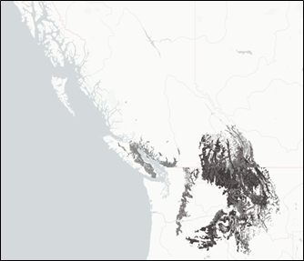
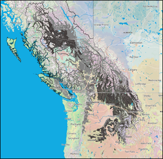

### OHR – “Outside Home Range” Suitabilities

The term “outside home range” (OHR) refers to occurrences of a tree species that has been planted and established in a geographical area (i.e. biogeoclimatic subzone-variant) where it does not occur naturally. In some cases, OHR species
were restricted by something other than climate, such as migration
limitations (for example, western larch) or forest health factors (for
example, western white pine limited by blister rust). We have added an
environmental suitability rating for OHR species for which there is
strong evidence that they were well suited to the climatic regime of the
historical reference period (1961-1990) that the species environmental
suitability ratings are based on.

Strong evidence includes species that have been capable of successful
establishment, productivity, and resilience in an area for at least
several decades as evidenced in long-term plantings of the
species. In other words, the area lies within the species’ historic
fundamental, but not realized, niche. These trees may not occur
naturally in the area of interest (AOI) due to low migration rates, geographic isolation,
or other non-climatic factors, but will likely be successful in this
area immediately. Supporting information may include such evidence as:

1.  Successful operational and research off-site trials \>30 years of
    the species in the AOI. E.g Douglas-fir and Western white pine
    plantations in the ICHmc2 of the Skeena region.

2.  Range modelling using historic climates strongly suggests their
    suitability.  E.g., western larch (Rehfeldt &
    Jaquish 2010).

3.  Extrapolated suitability into intermediate site or climatically
    similar areas. E.g. Douglas-fir added to SBSdk and ICHmc2 based on
    plantation evidence – extend into the ICHmc1 which is both a
    climatic and geographic intermediate between the two.

Figure 1. Range and environmental suitability of western larch in grey,
historical range (left) and including OHR ratings (right) from the
By-BEC tool.

#### Caveats and considerations for application

We have included OHR species where reasonable evidence exists to harness
the best available knowledge and more accurately capture the species’
fundamental climate niche. Species like western larch are being actively
managed and planted outside of their historical range. Excluding OHR
species would limit the effectiveness of the CCISS tool to inform
current forest management practices.

However, often suitability to the historical baseline climate
(1961-1990) is not proven. Successful operational and research trials
that extend well into the 1961-1990 period are less common. There are
limitations to range models 
and there is uncertainty in suitability extrapolated into intermediate
or climatically similar areas. We have included the option to remove OHR
suitability ratings from CCISS projections as there is less certainty in
the accuracy of these ratings. There is some hesitation around
projecting off-site species into future climate given the already high
levels of uncertainty in assisted migration. Users should interpret the
results with caution and use other lines of evidence and local knowledge
when making decisions.

As with all species planted in an assisted migration framework, risks
associated with planting off-site tree species will also depend on
climatic factors, including the (i) climatic distance between current
and future climates in a region, (ii) uncertainty in projected future
climates, and (iii) current climatic variability and extreme events
beyond the tolerance of species.

#### Functionality in the CCISS tool

If you click the “MODEL PARAMETERS” button on the home page, you have
the option to toggle OHR species on or off. If OHR species is “on”
future species environmental suitability will include projections based
on OHR species ratings. If “remove OHR suitabilities” is selected future
species suitability projections will not be based on suitability ratings
outside of a species’ home range.

Figure 2. Option to toggle OHR species on (left) or off (right) in the
CCISS tool.

#### References

Rehfeldt, Gerald & Jaquish, Barry. (2010). Ecological Impacts and
Management Strategies for Western Larch in the Face of Climate-Change.
Mitigation and Adaptation Strategies for Global Change. 15. 283-306.
10.1007/s11027-010-9217-2.
