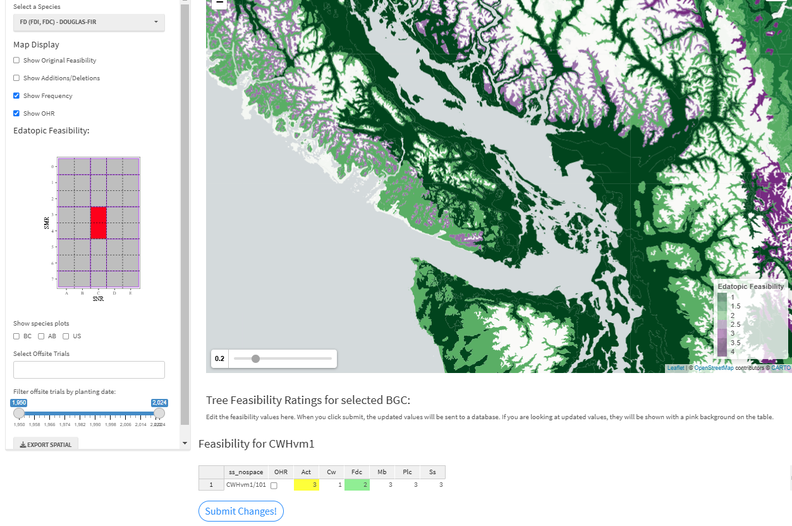
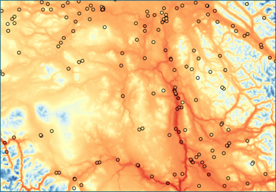
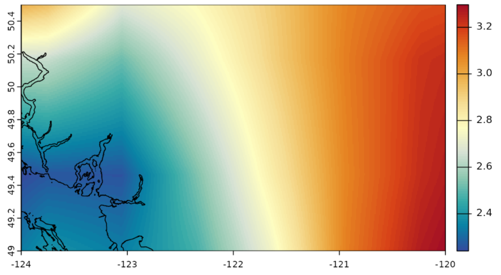

### Sources of error in data and analyses

The CCISS methodology has many components (input data and analyses),
each with their own sources of error in addition to the sources of
uncertainty described previously. While often used interchangeably,
error and uncertainty are different processes. Error is the absolute
difference between an estimated value and the ‘true’ value for a
quantity of interest that, in most cases, is unknown. Thus, unlike
uncertainty, error cannot be directly quantified. However, understanding
potential sources of error can help users determine appropriate uses for
CCISS projections.

#### Suitability ratings

Tree species' environmental tolerances are complex and many
approximations are required to translate them into a simple suitability
ratings metric used in CCISS. Suitability ratings for each tree species
in each site series have been assigned primarily through expert
judgement with support from vegetation plot data. There are inevitably
errors in this database, particularly for species that were not
historically prominent in reforestation, such as deciduous species. The
suitability ratings are undergoing ongoing review by the CCISS team and
regional ecologists. Further, the CCISS team is currently conducting
predictive modeling to quantitatively evaluate and refine suitability
ratings. For more information see Methods \> Expert Review

```{=html}

```
Figure 1: Screenshot of the [By-BEC
Portal](https://thebeczone.ca/shiny/bybecmap/), which facilitates expert
review and revisions of the CCISS suitability ratings. This example
shows suitability ratings for western redcedar on zonal sites, with
editing for the CWHdm open.

#### Climate mapping

The reference climate maps for CCISS are the PRISM (Parameter-elevation
Regressions on Independent Slopes Model) climate surfaces of temperature
and precipitation at 800m spatial resolution developed by the [Pacific
Climate Impacts
Consortium](https://www.pacificclimate.org/data/prism-climatology-and-monthly-timeseries).
These surfaces are best-in-class, but they have important limitations.
They are interpolated from weather station data that is sparse in many
regions of BC (Figure 2). Most valleys and some larger regions have no
stations, so the nuances of climate in these locations may not be well
represented, particularly cold air drainage and elevational gradients.
Further, the PRISM method does not model microclimatic factors such as
heat loading (warm vs. cold aspects), vegetation influences, and lake
effects. Microclimatic factors need to be accounted for during
professional interpretation of CCISS results.

```{=html}

```
Figure 2: PRISM climate map of July daily maximum temperature, in the
Cariboo-Chilcotin region. Stations are concentrated at low-elevations
and are absent from large areas, demonstrating the potential for errors
in the climate mapping.

#### Biogeoclimatic modeling

Biogeoclimatic modeling involves using machine learning to classify
climate conditions as biogeoclimatic units (subzones/variants). We have
found that BGC projections are sensitive to many aspects of model
training, especially climate variable selection. The current version of
the BGC projections is a work in progress, and future refinements will
be made. As more end users engage with the CCISS tool, additional issues
may come to light.

We have already identified several areas for improvement. One key issue
is that the baseline maps are not being perfectly reconstructed,
resulting in fuzzy boundaries, and the over- and underrepresentation of
certain BGC units. For example, the Coastal Mountain-heather Alpine
(CMA) zone in the Pemberton region appears to be consistently
underrepresented.

Additionally, future projections appear highly sensitive to changes in
sampling scheme, climate variable sets, and RF model hyperparameters.
These factors will be closely examined in future iterations to improve
the model’s predictive ability.

#### Climate data downscaling

Climate changes are modeled in CCISS by overlaying very coarse-scale
global climate model projections (50-150km resolution; Figure 3) onto
the 800m PRISM climate maps, a method called [change-factor
downscaling](https://bcgov.github.io/climr/articles/methods_downscaling.html).
This approach results in a uniform warming rate from valley bottom to
mountain top. In reality, we would expect elevation-dependent
differences in warming rate due to loss of snowpack, for example.
Similarly, change-factor downscaling can’t represent the role of other
fine-scale features like lakes, vegetation, cold-air pooling, aspect,
and soil moisture in modifying the regional average climate change. The
Ministry of Forests' ClimatEx project seeks to improve the spatial
resolution of climate change modeling, but will not be integrated into
CCISS for at least two years. CCISS users are encouraged to consider the
role of site-specific modification of regional climate changes.

```{=html}

```
Figure 3: Coarse resolution of climate changes provided by global
climate model data. This panel shows the low-resolution interpolated
changes in July mean temperature for the EC-Earth3 global climate model
for the 2041-2060 time period, relative to the model’s 1961-1990
climate. The coastline of Vancouver is shown for scale.
