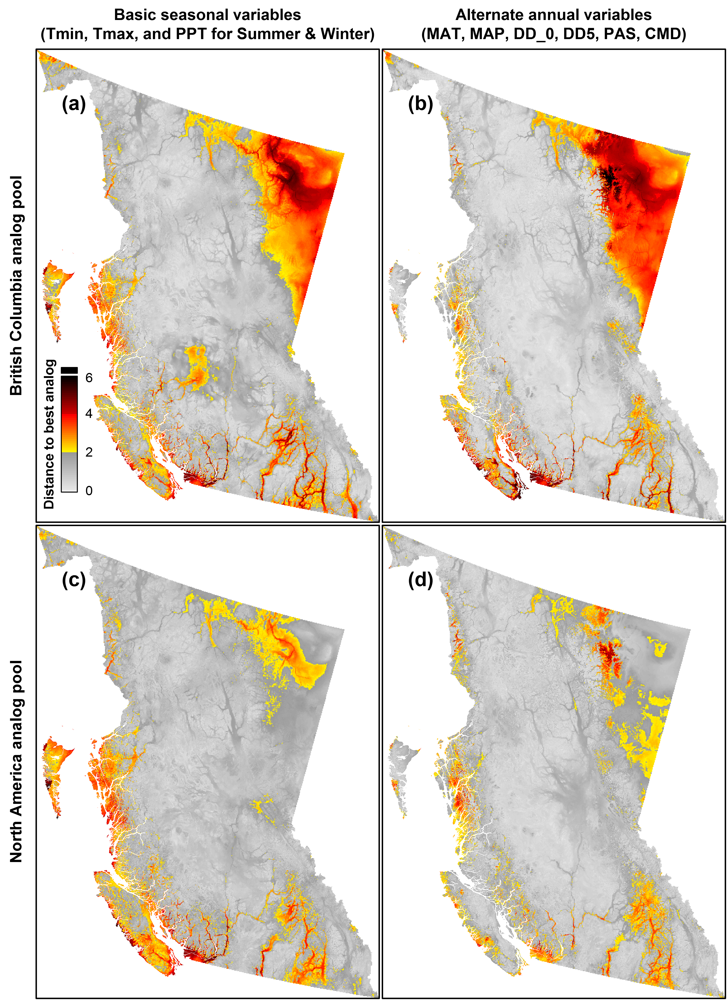

### Novel climates

CCISS uses the best available biogeoclimatic analog for each projected future climate condition. In some cases, the future climate condition does not have a good analog in the pool of historical climates; this is known as a novel climate. The biogeoclimatic model will choose the closest climate analog to the novel climate, but there may be substantial differences between the novel climate conditions and the climate conditions of climate analog. The basic problem of novel climates (poor analogs) is that they give misleading results but are not explicitly identified by the model. 

The spatial pattern of novel climates is quite well-defined and limited to a minority of British Columbia’s area (Figure 1). Figure 1 indicates that some regions of climatic novelty are sensitive to how climate is defined (i.e., which climate variables are used), for example on Haida Gwaii and southern Vancouver Island. Figure 1 (c & d) shows that using US and Alberta analogs reduces the problem of novel climates, especially in Northeast BC and the rocky mountain trench. Nevertheless, there are regions of BC with future climates that are novel to North America (Figure 1c), notably the hypermaritime fringe, the major valleys of southern BC, and the west Kootenays. CCISS results in these regions are prone to errors due to the confounding effects of novel climates. 

Figure 1: Patterns of climatic novelty for British Columbia for the 2041-2070 period (RCP4.5), following the method of [Mahony et al. (2018)](https://www.sciencedirect.com/science/article/abs/pii/S0378112717319175). Rows show novelty relative to locations limited to BC vs. North America. Columns show novelty measured in terms of different climate variables.  

Novel climates cause the following examples of misleading results: 

- Hypermaritime climates (e.g., CWHvh) tend to self-analog even under significantly different climates because there is no warmer version of these very rainy climates in North America. As a result, feasibility changes in hypermaritime regions are likely underestimated in CCISS. 
- CWHvh analogs for future climates of the submontane CWHvm1. While superficially warmer than the vm, inland and uphill movement of hypermaritime climates is not a credible shift under climate change. 
- CWHms/ds and MHmm2 analogs for future climates of the ICH and ESSF in the west Kootenays.  These reflect a lack of warmer-but-wet mountain climates south of the border. Feasibility declines are likely underestimated by these analogs for coastal species (Cw, Hw, Fd) and overestimated for interior species (Lw, Py). 
- Coastal Redwood Forest (CRF) analogs for the future climates of the CDFmm. There are substantial differences in the climate of coastal northern California (e.g., persistent summer fog) that suggest this is likely a poor analog. 
- Washington CWH analogs for the future climates of the dry CWH of the Georgia Basin are an under-representation of the degree of climate change. In general, climate changes are under-represented by the climate analogs for novel climates: the best analog for novel future climates tends to be similar to the local historical climate (Mahony et al. 2018). The lack of decline in projected Cw feasibility in the Georgia basin may be an artefact of this under-representation of climate change due to novel climates. 

 
